# 从与非门开始搭逻辑门

直接去啃《CS:APP》里的计算机结构，我有时很难把抽象的描述和一条实际电路对应起来。所以先借《Turing Complete》动手搭门，再回头理解 CPU 是怎么从简单的判断一步步做出复杂操作的。这一篇先记布尔代数里最基础的几个门。

下面用 `T` 表示真（也可以看作 `1`），用 `F` 表示假（也可以看作 `0`）。`A`、`B` 是输入，`Q` 是输出。图里的分叉表示**同一个输入接到多个位置**。

所谓布尔值，就是只取真、假两种值。逻辑门接收这样的值，再按固定规则给出结果。后面的真值表，就是把所有输入组合及其输出列出来：两路输入各有两种取值，一共是 `2×2 = 4` 行；三路是 `2×2×2 = 8` 行。每一行代表一种独立情况，行的上下顺序本身不代表时间先后。

“真”表示所描述的条件成立，“假”表示不成立，不是在评价答案对错。例如 A 表示“按钮被按下”，那么按下时 A 为 T，没按下时为 F。电路输出 F 也可能正是题目要求的正确结果。

公式里的 `AND(A, B)` 表示“把 A、B 送入 AND”；`NOT(A)` 表示“把 A 送入 NOT”。遇到嵌套式子，例如 `NOT(AND(A, B))`，先算最里面的 AND，再把它的一个输出送给外面的 NOT。

每只门只按接到自己输入端的值算出一个输出。把第一只门的输出接到第二只门，第二只门拿到的就是第一只门算出的 `T` 或 `F`；线分叉时，各条支路拿到同一个值。

图中标着 AND、NAND 等名字的框就是相应的门，通常从左往右读。一个输出可以分支送到多只门；若要把两个判断合起来，则需要选一只门接收它们，不能把两个输出直接并到同一根线上来代替 AND 或 OR。

读接线图时，可以先固定 `A`、`B` 的一组值，沿着线算出中间结果，再算到 `Q`。两路输入共有四种组合，把四种情况都算完，若最终 `Q` 与某种门的真值表逐行相同，整条电路对外就实现了那种门。后面的 `X`、`S` 只是给中间线起的名字，方便记下每一步。

## 为什么从 NAND 和 NOT 开始？

NAND 是「与非门」：先判断 `A` 和 `B` 是否**都为真**，再把结果取反。它特别有用：把同一路输入接到 NAND 的两端，可以得到 NOT；给 NAND 的输出再取反，可以得到 AND；先给两个输入分别取反，再送入 NAND，可以得到 OR。下面逐个把每条接线的输出算出来。

为什么有了 NOT、AND、OR 就够用了？例如只想认出 `A = T、B = F`：先用 `NOT(B)` 让「`B` 是 `F`」变成一个 `T`，再用 `AND(A, NOT(B))` 要求这两个条件同时成立。如果有好几种输入组合都应该输出 `T`，就分别做出这些条件，再用 OR 合起来。照这个方法，可以从目标真值表逐行搭出需要的布尔逻辑。

所谓「万能门」，说的就是**只用一种门也能搭出其他逻辑门**的能力；NAND 能做出 NOT、AND、OR，所以它是一种万能门。严格来说，NOT 也能由 NAND 做出来；游戏把它单独拿出来，接线和理解取反都会更直观。

为什么不是随便选一种门？只用 AND 或只用 OR，都没法把一个输入取反。NOR（或非门）其实也能单独搭出所有布尔逻辑，所以 NAND 不是唯一的选择。从 NAND 开始，既能用很少的基本规则推导其他门，也能看到这些门之间的关系。

这和 CPU 的物理实现确实有联系，但游戏画的是**逻辑层**。以常见的静态 CMOS 电路为例，NOT 可以用 2 个晶体管实现，两输入 NAND 可以用 4 个晶体管实现；一个直接的 AND 实现是 NAND 后接 NOT，共 6 个晶体管。真实芯片还会根据速度、面积和功耗选用不同的门与组合电路，并不会把所有东西都逐个拆成游戏里的 NAND。游戏先让我弄清「输出应该是什么」，之后再去理解「晶体管怎样产生这个输出」。

晶体管在这里可以先理解成由电信号控制的小开关；CMOS 是用两类晶体管搭电路的一种常见方式。现在不用先学会晶体管接线，只要分清两层：真值表规定一个门应当做什么，晶体管电路负责在物理上把它做出来。

## 1. 与非门（NAND）

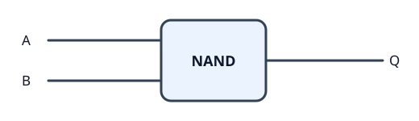

「与非」可以按名字顺序读：先做「与」，判断两路是否都为 `T`；再做「非」，把这个判断结果取反。AND 只有在 `T、T` 时输出 `T`，因此 NAND 只有在 `T、T` 时输出 `F`，其余情况都输出 `T`。写成规则就是 `NAND(A, B) = NOT(AND(A, B))`。

这里的「先与后非」是在说明输出怎么算，并不要求实际电路里必须放一只 AND 再接一只 NOT。

| A | B | Q = NAND(A, B) |
| --- | --- | --- |
| F | F | T |
| F | T | T |
| T | F | T |
| T | T | F |

## 2. 非门（NOT）

非门只接收**一个布尔值**，输出它的相反值。

| A | Q = NOT(A) |
| --- | --- |
| F | T |
| T | F |

在游戏里，如果手头只有 NAND，可以把**同一根输入线接到 NAND 的两个输入端**：

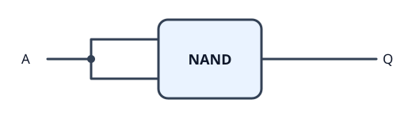

这不是给 NAND 两个不同的值。`A` 如果是 `T`，两个输入就是 `T、T`，NAND 按上一张表输出 `F`；`A` 如果是 `F`，两个输入就是 `F、F`，NAND 输出 `T`。所以它对外表现得正好像一个 NOT。写成式子就是 `NAND(A, A) = NOT(A)`。

## 3. 与门（AND）

AND 只有在两个输入都为 `T` 时，才输出 `T`。

NAND 恰好在 `A = T、B = T` 时输出 `F`，其余时候输出 `T`，每一行都与 AND 的要求相反。把 NAND 的输出接给 NOT：

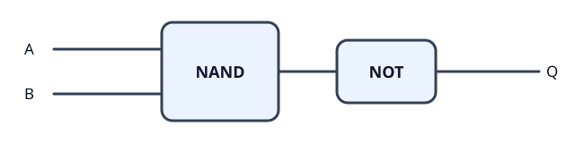

把两只门之间的线叫 `X`。先算 `X = NAND(A, B)`，再算 `Q = NOT(X)`：

| A | B | X = NAND(A, B) | Q = NOT(X) |
| --- | --- | --- | --- |
| F | F | T | F |
| F | T | T | F |
| T | F | T | F |
| T | T | F | T |

第一行中，NAND 收到 `F、F`，先给 `X = T`；NOT 收到这个 `T`，给出 `Q = F`。最后一行则是 `X = F`，再变成 `Q = T`。看最后一列，只有两路都为 `T` 时输出才为 `T`，所以这两只门组成的电路就是 AND：`AND(A, B) = NOT(NAND(A, B))`。

## 4. 或非门（NOR）

「或非」也是按名字顺序读：先做「或」，只要有一路为 `T` 就输出 `T`；再做「非」，把结果取反。OR 只在 `F、F` 时输出 `F`，因此 NOR 只在 `F、F` 时输出 `T`。这就是 `NOR(A, B) = NOT(OR(A, B))`。

我在游戏里用两路 NOT、一个 NAND、最后再接一个 NOT：

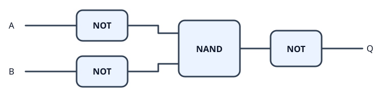

先给四只门之间的结果起名：`U = NOT(A)`，`V = NOT(B)`，`X = NAND(U, V)`，最后 `Q = NOT(X)`。每一行都按这个顺序往右算：

| A | B | U = NOT(A) | V = NOT(B) | X = NAND(U, V) | Q = NOT(X) |
| --- | --- | --- | --- | --- | --- |
| F | F | T | T | F | T |
| F | T | T | F | T | F |
| T | F | F | T | T | F |
| T | T | F | F | T | F |

第一行里，两个 `F` 先被翻成 `T、T`，NAND 才会给出 `X = F`，最后 NOT 得到 `Q = T`。另外三行至少有一路原输入为 `T`，取反后 NAND 至少收到一个 `F`，于是 `X = T`，最后 `Q = F`。看最后一列，整个电路只在 `F、F` 时输出 `T`，正好是 NOR。

```text
NOR(A,B) = NOT(NAND(NOT(A), NOT(B)))
```

只看中间的 `X` 一列，输出依次是 `F、T、T、T`，恰好是 OR 的真值表；最后的 NOT 再把 OR 的结果变成 NOR。

## 5. 或门（OR）

OR 比 NOR 直观一些：**只要两个输入中至少有一个是 T，输出就是 T**。

| A | B | Q = OR(A, B) |
| --- | --- | --- |
| F | F | F |
| F | T | T |
| T | F | T |
| T | T | T |

把 `B` 分成两路分别取反：一路与 `A` 接入第一个 NAND，另一路与第一个 NAND 的输出接入第二个 NAND。两只 NOT 都收到同一个 `B`，因此在同一组输入下，它们给出的值也相同，都是 `NOT(B)`。

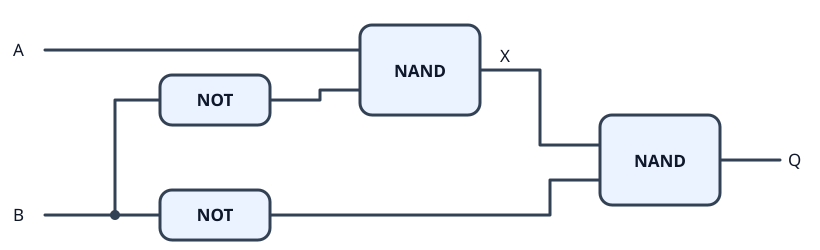

记第一个 NAND 的输出为 `X`，那么 `X = NAND(A, NOT(B))`，最终输出是 `Q = NAND(X, NOT(B))`。按 `B` 的值拆开看，比直接背公式容易：

- 如果 `B = T`，那么 `NOT(B) = F`。第二个 NAND 只要有一个输入是 `F`，就一定输出 `T`，符合 OR。
- 如果 `B = F`，那么 `NOT(B) = T`。第一个 NAND 变成 `NOT(A)`；第二个 NAND 再把这个结果取反，最后输出的就是 `A`。这时 `A OR F` 也正好等于 `A`。

逐项代入四种输入，输出与 OR 的真值表一致：

| A | B | NOT(B) | X = NAND(A, NOT(B)) | Q = NAND(X, NOT(B)) |
| --- | --- | --- | --- | --- |
| F | F | T | T | F |
| F | T | F | T | T |
| T | F | T | F | T |
| T | T | F | T | T |

如果只想用更少的门，OR 还可以用**两路 NOT 加一个 NAND**：

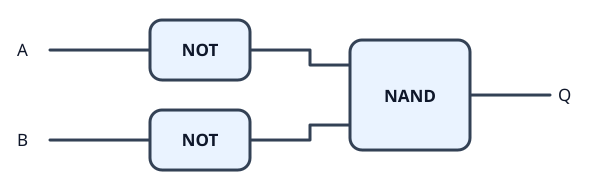

```text
OR(A,B) = NAND(NOT(A), NOT(B))
```

两个原输入都为 `F` 时，反相后的两个输入才会同时为 `T`，NAND 输出 `F`；只要原输入有一个是 `T`，反相后就至少有一个 `F`，NAND 输出 `T`。这个更短的接法，也解释了上面 NOR 为什么只需在 OR 后面再取反。

## 6. 长明灯（恒真）

这里只有一个输入 `A`，目标是让输出 `Q` 不管输入是什么都为 `T`。

| A | Q |
| --- | --- |
| F | T |
| T | T |

我的接法是把 `A` 同时送到 NAND 的两个输入端，得到 `NOT(A)`；原来的 `A` 也直接接到 OR，与 `NOT(A)` 一起作为 OR 的输入：

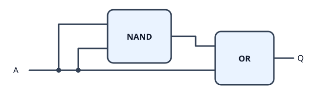

```text
Q = OR(A, NAND(A, A))
  = OR(A, NOT(A))
  = T
```

当 `A = F` 时，`NOT(A) = T`，OR 收到 `F、T`；当 `A = T` 时，`NOT(A) = F`，OR 收到 `T、F`。无论哪一种，OR 都输出 `T`。

还可以把最后的 OR 换成 NAND，同样只用两只门：

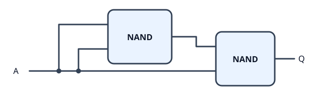

```text
Q = NAND(A, NAND(A, A))
  = NAND(A, NOT(A))
  = T
```

这里的道理是：`A` 和 `NOT(A)` 不可能同时为 `T`，所以 NAND 永远不会遇到让它输出 `F` 的那种输入。这种接法没有减少游戏里的门数，只是只用 NAND 就完成了。同样假设没有现成的固定 `T` 信号，前面这些门单独接一个输入时，只能得到 `A` 或 `NOT(A)`；因此两只门已经是最少的。

这里说的「恒真」是针对 `A = F` 或 `A = T` 这两种稳定输入。真实电路的信号切换有传播延迟，瞬间是否出现毛刺还要结合实际电路判断。

## 7. 第二拍：从输入和输出开始推

时钟是一条有规律变化的信号，相邻两次同方向的时钟边沿之间是一个周期。假设频率是 `1 Hz`，一个周期就是 `1 秒`。输入 `A`、`B` 是送进电路的值，和「现在第几个周期」是两回事：它们可以在下一周期改变，也可以一直不变。同步电路里的寄存器通常在时钟的有效边沿读取输入；这一关用到的门，则根据当前输入产生输出。([同步设计中的时钟边沿与寄存器](https://docs.altera.com/r/docs/683082/25.1/quartus-prime-pro-edition-user-guide-design-recommendations/implementing-synchronous-designs))

“边沿”就是时钟从低变高或从高变低的那个时刻，分别叫上升沿、下降沿。例如相邻上升沿出现在第 0 秒、第 1 秒、第 2 秒，周期就是 1 秒。时钟从低到高再回到低，才走完一次完整变化，不能把高、低两个阶段各算成一个完整周期。

在这个例子里，数据输入 A 可以连续两秒都是 T；即使时钟已经走过两个周期，A 也不必改变。实际同步电路通常要求数据在采样边沿前后的一小段时间稳定，不是要求它在整个周期内绝对不变。这里先记住：时钟决定何时采样，数据线提供要采样的值。

### 时钟周期和 CPU 的 Hz、MHz、GHz 是什么关系？

**时钟频率说的是一秒有多少个周期，时钟周期说的是一个周期持续多久。** 频率的单位是 Hz，中文叫赫兹。每秒 1000 个周期，就是 1000 Hz，也就是 1 kHz。

| 时钟频率 | 每秒的周期数 | 一个周期持续多久 |
| --- | --- | --- |
| 1 Hz | 1 | 1 秒 |
| 1 kHz | 1000 | 1 毫秒，即千分之一秒 |
| 1 MHz | 1000000 | 1 微秒，即百万分之一秒 |
| 1 GHz | 1000000000 | 1 纳秒，即十亿分之一秒 |

Hz、kHz、MHz、GHz 相邻两档相差 1000 倍。计算周期时，先把频率换成 Hz：

```text
周期时长（秒）= 1 ÷ 频率（Hz）

1000 Hz：一个周期 = 1 ÷ 1000 秒 = 1 毫秒
         两个周期 = 2 × 1 毫秒 = 2 毫秒
```

CPU 所说的几 GHz，也是时钟频率。例如一个核心以 3 GHz 运行，表示它的时钟每秒有 30 亿个周期，每个周期约为三分之一纳秒。频率越高，留给相邻采样边沿之间那段计算的时间就越短；这也解释了为什么逻辑门的传播延迟会限制时钟频率。

**一个周期不等于执行一条指令，也不等于经过一个逻辑门。** 可以把时钟理解成节拍器：组合逻辑在节拍之间传播信号、计算结果，寄存器在约定的时钟边沿保存结果。一次计算可以经过多只门；一条指令也可能跨越多个周期。采用流水线和并行执行的 CPU，还可能在同一个周期完成多条指令。因此，主频说明节拍有多快，实际运行速度还取决于每拍能完成多少工作，不能只比较 GHz 就判断所有 CPU 的快慢。

### 根据每一拍的输入推导电路

第二拍是时间顺序上的第二次推进。要设计这关的电路，我先把每一拍给出的**两路输入**和**期望输出**排在一起：

| 测试推进到 | 输入 0：`A` | 输入 1：`B` | 期望输出 `Q` |
| --- | --- | --- | --- |
| 第 1 拍 | F | F | F |
| 第 2 拍 | T | F | T |
| 第 3 拍 | F | T | F |
| 第 4 拍 | T | T | F |

从零开始想，可以只盯着期望输出为 `T` 的那一行：

1. 第二拍需要输出 `T`，此时 `A = T`、`B = F`。
2. 直接拿 `A`，它在 `A = T` 时就是 `T`。
3. `B` 需要是 `F`，所以先用 NOT 把 `B` 取反；只有 `B = F` 时，`NOT(B)` 才是 `T`。
4. 两个条件要**同时满足**，就把 `A` 和 `NOT(B)` 一起接入 AND。

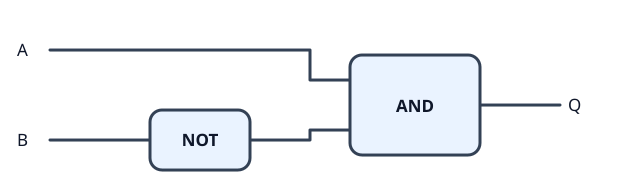

```text
Q = AND(A, NOT(B))
```

再把四行都代进去检查一次：

| `A` | `B` | `NOT(B)` | `AND(A, NOT(B))` |
| --- | --- | --- | --- |
| F | F | T | F |
| T | F | T | T |
| F | T | F | F |
| T | T | F | F |

这就是从真值表入手的办法：先找输出为 `T` 的输入组合，再让电路只在这个组合下输出 `T`。这关的第二拍恰好有独特的 `T、F` 输入，所以不需要电路自己数到第二拍。

### R1、R2 是什么？

`R1`、`R2` 是给两只寄存器起的名字，寄存器能保存值。之前用它们举例，是想说明：如果两次输入完全相同，却要求两次输出不同，电路就必须有办法区分这两次，例如保存已经走到哪一步的状态。

它们不参与这里的 `NOT + AND` 接法。比如第五拍再次给 `A = T、B = F`，这条电路仍会输出 `T`，因为它只看眼前的输入。真正要做只在第二周期出现一次的脉冲，需要先明确复位时刻和周期如何编号，再设计保存状态的电路；这部分留到寄存器和时序电路再展开。

### 固定的高、低电平

游戏里的固定 `T`、固定 `F`，在真实数字芯片里也有对应的**逻辑常量 1、0**。它们不需要随着数据输入变化。芯片有电源和地，逻辑电路以电压范围区分高、低电平；实际设计中也会使用专门提供常量的单元。比如 [SkyWater 标准单元库的 `conb`](https://skywater-pdk.readthedocs.io/en/main/contents/libraries/sky130_fd_sc_hs/cells/conb/README.html) 没有数据输入，却有 `HI` 和 `LO` 两个固定输出；[Yosys 的 `hilomap`](https://yosyshq.readthedocs.io/projects/yosys/en/0.27/cmd/hilomap.html) 可以把设计里的常量映射到这类单元。这里的「固定」以芯片正常供电为前提。

所以「恒真电路」和「固定 `T` 信号」在逻辑上都能给出 `T`，但硬件不必为了得到常量，真的搭一遍 `OR(A, NOT(A))`。固定高低电平也不会告诉电路现在是第几个周期。

## 8. 异或门（XOR）

XOR 是 exclusive OR，`X` 来自 exclusive，意思是「排他的」。普通 OR 允许「A 为真、B 为真、两者都为真」；双输入 XOR 把「两者都为真」排除，只保留一真一假。所以「异或」也可以直接读成：两路输入不同，输出才为 `T`。两路都为 `F` 不行，两路都为 `T` 也不行。[TI 的逻辑门分类](https://www.ti.com/product-category/logic-voltage-translation/logic-gates/overview.html)中，XOR、XNOR 分别对应 exclusive OR、exclusive NOR。

| A | B | Q = XOR(A, B) |
| --- | --- | --- |
| F | F | F |
| F | T | T |
| T | F | T |
| T | T | F |

我先试着让 `A`、`B` 各进入一个 AND，并给每个 AND 的另一端接固定的 `T`，再把两路结果接进 NAND。先不看整张线路，只算每一步：

```text
AND(A, T) = A
AND(B, T) = B
```

也就是说，前两个 AND 并没有改变 `A`、`B`；最后实际得到的是 `NAND(A, B)`。NAND 只在两个输入都为 `T` 时输出 `F`，所以它已经处理好了 `T、T`，却会在 `F、F` 时输出 `T`。这正是和 XOR 差的那一行。

怎么只把 `F、F` 排除掉？OR 恰好只在 `F、F` 时输出 `F`。把原来的 `A`、`B` 同时送进 OR 和 NAND，再把这两个结果送进 AND：

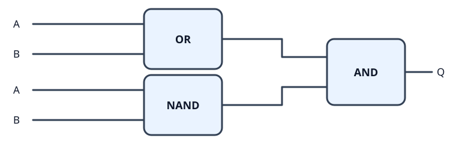

图中重复写出的 `A`、`B` 是同两路输入，分别送到 OR 和 NAND。

```text
Q = AND(OR(A, B), NAND(A, B))
```

| A | B | OR(A, B) | NAND(A, B) | 最终 Q |
| --- | --- | --- | --- | --- |
| F | F | F | T | F |
| F | T | T | T | T |
| T | F | T | T | T |
| T | T | T | F | F |

这条线路可以分成两道同时要通过的判断：OR 问「**至少有一路为真吗**」，因此把 `F、F` 排除；NAND 问「**是不是没有两路都为真**」，因此把 `T、T` 排除。最后的 AND 只有收到两个 `T` 才输出 `T`，所以只剩 `F、T` 和 `T、F` 两种情况。

逐项看也是一样：`F、F` 时 OR 输出 `F`，最后过不了 AND；`T、T` 时 NAND 输出 `F`，也过不了 AND；一真一假时 OR 和 NAND 都输出 `T`，最后的 AND 才输出 `T`。按这条线路，关卡可以通过。原来接固定 `T` 的两个 AND 可以省掉，直接把 `A`、`B` 接到 OR 和 NAND 即可。

## 9. 三路或门与三路与门

多一路输入，可以先把 `A`、`B` 算成一个中间结果 `S`，再把 `S` 和 `C` 接进第二只门。`S` 也是一位 `T` 或 `F`，因此对第二只门来说，它和直接送来的 `C` 一样，都是可以继续计算的输入。这样仍然只需要已经做过的双输入门。

### 三路或门（OR3）

三路 OR 的要求是：`A`、`B`、`C` 中只要有一路为 `T`，输出就是 `T`。先问「`A`、`B` 中有没有 `T`」，再把这个答案和 `C` 一起送进 OR：


```text
S = OR(A, B)
Q = OR(S, C) = OR(OR(A, B), C)
```

如果 `A`、`B` 中已经有 `T`，那么 `S = T`，最后一定输出 `T`；如果它们都是 `F`，那么 `S = F`，最后就由 `C` 决定。只有三路全为 `F`，输出才是 `F`。

### 三路与门（AND3）

三路 AND 的要求是：`A`、`B`、`C` 必须全为 `T`，输出才是 `T`。先问「`A`、`B` 是否都为 `T`」，再把这个答案和 `C` 一起送进 AND：

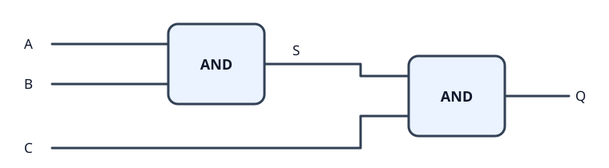

```text
S = AND(A, B)
Q = AND(S, C) = AND(AND(A, B), C)
```

如果 `A`、`B` 中有一路是 `F`，那么 `S = F`，最后一定输出 `F`；只有它们都是 `T` 时，才继续看 `C`。于是只有三路全为 `T`，输出才是 `T`。

把八种输入组合放在一起核对：

| A | B | C | OR3 | AND3 |
| --- | --- | --- | --- | --- |
| F | F | F | F | F |
| F | F | T | T | F |
| F | T | F | T | F |
| F | T | T | T | F |
| T | F | F | T | F |
| T | F | T | T | F |
| T | T | F | T | F |
| T | T | T | T | T |

这里确实用了两级门，关键是把前两路的判断结果当成新的一路输入。先合并哪两路都可以，例如 `OR(OR(A, B), C)` 与 `OR(A, OR(B, C))` 的输出相同；AND 也一样。这叫结合律。以后输入更多时，也可以先两两分组，再逐层合并。

这里的「两级」指信号依次经过两只门，并不是要等两个时钟周期。它们是组合逻辑：输入确定后，输出会在门的传播延迟之后确定，不会替电路记住过去了几拍。

## 10. 输入变化后，输出为什么会晚一点？

看上一节的三路 OR：`A`、`B` 先进入第一只 OR，结果 `S` 再和 `C` 进入第二只 OR。假设原本三路都是 `F`，现在只有 `A` 从 `F` 变成 `T`，变化会先传到 `S`，再传到最终输出 `Q`。从输入变化到相应输出变化所需的时间，叫传播延迟（propagation delay，常写作 `t_pd`）。真实的逻辑门也有传播延迟：晶体管切换、输出端及连线的电容充放电都需要时间。[TI 的逻辑器件设计说明](https://www.ti.com/lit/an/sdya002/sdya002.pdf)讨论了门内部、输出切换和负载电容带来的延迟。

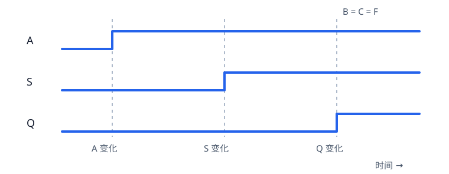

图中 `B`、`C` 一直为 `F`；横向表示时间，间隔只表示先后，不代表固定时长或三个时钟周期。`A` 到 `Q` 经过两只 OR；如果改为 `C` 从 `F` 变成 `T`，它到 `Q` 只经过最后一只 OR。因此，同一个电路里，不同输入到输出的路径也可能有不同延迟。

传播延迟用实际时间描述，不能只凭经过了几只门就算出准确数值。门的种类、负载和布线都会影响一条路径的耗时。它也不等于「晚一个时钟周期」：组合逻辑不会按拍保存输入，只是信号需要时间才能传到输出。

### 什么时候需要优化？

先找从输入到输出耗时最长的那条路。在只用双输入 OR 的前提下，三路 OR 无论先合并哪两路，最深都需要两级；三路 AND 也是一样。如果某一路输入本来就来得较晚，可以让它直接进入最后一只门，让另外两路先算。输入更多时，分组方式会更明显地影响最长路径，例如四路 OR：

```text
逐个接：OR(OR(OR(A, B), C), D)    最长经过 3 只门
两两合并：OR(OR(A, B), OR(C, D))   最长经过 2 只门
```

在有时钟的 CPU 电路里，寄存器之间的组合逻辑要赶在下一次采样前给出稳定结果；耗时最长的路径叫关键路径。关键路径太慢时，可以改逻辑结构、调整门和布线，或把计算分段并加入寄存器。加入寄存器会改变结果经过的周期数，是后面再学的时序设计问题。[Intel 的 FPGA 设计说明](https://www.intel.com/content/www/us/en/docs/oneapi-fpga-add-on/developer-guide/2024-0/concepts-of-fpga-hardware-design.html)也用关键路径解释了传播延迟对时钟频率的限制。当前这两只门组成的三路 OR、AND，先把功能和最长路径看明白就够了。

## 11. 同或门（XNOR）

同或门判断两路输入是否相同：`F、F` 和 `T、T` 时输出 `T`，一真一假时输出 `F`。XNOR 可以按「先算 XOR，再把结果取反」理解：XOR 判断不同，取反以后就变成判断相同。

| A | B | XOR(A, B) | XNOR(A, B) |
| --- | --- | --- | --- |
| F | F | F | T |
| F | T | T | F |
| T | F | T | F |
| T | T | F | T |

接线是先让 `A`、`B` 进入 XOR，再把 XOR 的输出接到 NOT：

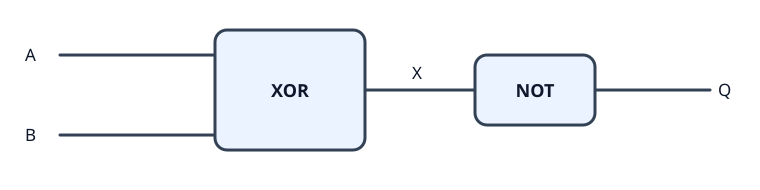

```text
X = XOR(A, B)
Q = NOT(X) = NOT(XOR(A, B))
```

当两路相同时，XOR 先输出 `F`，NOT 把它变成 `T`；当两路不同时，XOR 先输出 `T`，NOT 把它变成 `F`。所以最后留下的正好是两路相同的两种情况。如果把 XOR 展开，NOT 就接在前一节 `AND(OR(A, B), NAND(A, B))` 的输出后面。

## 12. 把这些门放在一起看

先只看双输入门。表头的 `F,F` 表示 `A = F、B = F`，其余三列也按 `A、B` 的顺序读：

| 门 | F,F | F,T | T,F | T,T | 什么时候输出 `T` |
| --- | --- | --- | --- | --- | --- |
| AND（与） | F | F | F | T | 两路都为 `T` |
| NAND（与非） | T | T | T | F | 除了两路都为 `T` |
| OR（或） | F | T | T | T | 至少一路为 `T` |
| NOR（或非） | T | F | F | F | 两路都为 `F` |
| XOR（异或） | F | T | T | F | 一路为 `T`、另一路为 `F` |
| XNOR（同或） | T | F | F | T | 两路相同：都为 `F` 或都为 `T` |

所以，如果要求「两路都为 `F` 或两路都为 `T` 时输出 `T`」，要找的就是 XNOR；如果只要一真一假时输出 `T`，就是 XOR。AND 和 NAND、OR 和 NOR、XOR 和 XNOR 各成一对：同一组输入下，两门的输出总是相反。

复习时还可以按同一个规律记这三对门：与非是「与」的结果再取非，或非是「或」的结果再取非；同或则可以从「异或的结果再取非」来理解。

在 NAND、NOR、XNOR 这些名字里，`N` 表示把相应运算的**最终结果取反**；`X` 表示 exclusive，说明这里的「或」带有排他条件。可以这样拆开记：

| 名称 | 按什么顺序理解 | 双输入时留下的情况 |
| --- | --- | --- |
| NAND | AND，再 NOT | 排除两路都为真 |
| NOR | OR，再 NOT | 只留下两路都为假 |
| XOR | 排他的 OR | 只留下一真一假 |
| XNOR | XOR，再 NOT | 只留下两路相同 |

注意取反的位置：`NOT(AND(A, B))` 是把 AND 算完后的一个结果翻转；`AND(NOT(A), NOT(B))` 是先翻转两个输入，再做 AND。两者的顺序不同，输出也不同。例如 `A = F、B = T` 时，前者为 `T`，后者为 `F`。门名可以帮助理解规则，接线时仍要看清楚每个 NOT 接在哪一条线上。

```text
NAND(A, B) = NOT(AND(A, B))
NOR(A, B)  = NOT(OR(A, B))
XNOR(A, B) = NOT(XOR(A, B))
```

NOT 只有一路输入，负责把它取反；前面做的长明灯则不受输入变化影响：

| A | NOT(A) | 长明灯 |
| --- | --- | --- |
| F | T | T |
| T | F | T |

三路 OR 和三路 AND 仍按同一规则判断：三路 OR 只在 `F、F、F` 时输出 `F`；三路 AND 只在 `T、T、T` 时输出 `T`。增加输入路数，并没有改变 OR 的「至少一路为真」和 AND 的「全部为真」。

## 13. 五道组合逻辑练习

这五题都给出两路输入 `A、B`，要求用指定的门搭出另一种门。可用的门种类有限，但同一种门可以重复使用；固定高、低电平分别记作 `T、F`。

我最初的做法是：先写两列输入，再把所有可用门直接接收 `A、B` 时的输出列出来，最后与目标列比较。这个起点是对的：它把每种门「能认出哪些输入情况」摆在了一起。比较费劲的是列完表以后，还得慢慢想哪几列能拼出答案。

要补上的一步，是把「比较输出」变成一个具体问题：**目标为真的那些行，可以由哪些列共同满足、合并得到，或者通过比较相同与不同得到？**

### 从真值表到接线，中间怎样推？

先固定行的顺序，后面所有表都按 `F,F → F,T → T,F → T,T` 排列。NOT 只有一个输入，需要分别看 `NOT(A)` 和 `NOT(B)`；高、低电平则不随 `A、B` 改变：

| A | B | NOT(A) | NOT(B) | 固定 T | 固定 F |
| --- | --- | --- | --- | --- | --- |
| F | F | T | T | T | F |
| F | T | T | F | T | F |
| T | F | F | T | T | F |
| T | T | F | F | T | F |

假设前面算出了两列中间结果 `U、V`，最后一只门就是逐行接收它们。选不同的末级门，相当于按不同规则挑选表里的行：

| 最后一只门 | Q 在哪些行是 T | 比较两列时看什么 |
| --- | --- | --- |
| AND(U, V) | U、V 同时为 T | 两列共同为真的行 |
| OR(U, V) | U、V 至少一列为 T | 任意一列为真的行 |
| XOR(U, V) | U、V 不同 | 两列不同的行 |
| XNOR(U, V) | U、V 相同 | 两列相同的行，包括两列都为 F |
| NAND(U, V) | U、V 没有同时为 T | 去掉两列同时为真的行 |
| NOR(U, V) | U、V 同时为 F | 两列共同为假的行 |

比如，目标只想在某一行输出 `T`，就可以寻找「仅在那一行不同」的两列，最后接 XOR；如果目标只想在某一行输出 `F`，就可以寻找「仅在那一行不同」的两列，最后接 XNOR。这就把模糊的尝试变成了有方向的查找。

还有一个容易绕进去的地方：**最后一只门判断的是 U、V，不一定是原来的 A、B。** 即使最后放的是 XNOR，整条电路也未必实现 XNOR，因为前面的门已经改变了送到它面前的值。

同一对 `A、B` 同时接给两只门，就形成了两条并行支路。图中重复出现的 `A、B` 都是同一对输入；两条支路的输出 `U、V` 分别接到末级门的两个输入端，保持为两条独立的线。

### 第 1 题：用给定的门搭出 OR

**题目：** 可用 XNOR、XOR、NAND、AND、NOT，以及固定高、低电平。要求只有 `A、B` 都为 `F` 时输出 `F`，其余情况输出 `T`。

#### 先列出可用门和目标

NOT 和常量的列沿用前面的公共表。其余门先直接接收 `A、B`：

| A | B | XNOR | XOR | NAND | AND | 目标 OR |
| --- | --- | --- | --- | --- | --- | --- |
| F | F | T | F | T | F | F |
| F | T | F | T | T | F | T |
| T | F | F | T | T | F | T |
| T | T | T | F | F | T | T |

我的解法是让 `A、B` 同时进入 XOR 和 NAND，再把两路结果接入 XNOR。回到表里，可以这样找到它：

1. 目标只有第一行是 `F`。若最后用 XNOR，就要找两列：第一行不同，其他三行相同。
2. 对照 XOR 与 NAND：第一行分别是 `F、T`，正好不同。
3. 中间两行都是 `T、T`，最后一行都是 `F、F`，这三行又正好相同。
4. 因此让 XNOR 比较这两列，它就只会在第一行给出 `F`。

#### 最终电路与验证

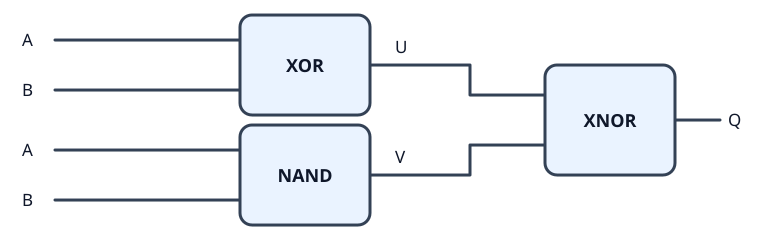

```text
U = XOR(A, B)
V = NAND(A, B)
Q = XNOR(U, V)
```

| A | B | U = XOR(A, B) | V = NAND(A, B) | Q = XNOR(U, V) |
| --- | --- | --- | --- | --- |
| F | F | F | T | F |
| F | T | T | T | T |
| T | F | T | T | T |
| T | T | F | F | T |

最后一行尤其值得看：原输入是 `T、T`，但最后的 XNOR 收到的是 `F、F`。XNOR 看到两个值相同，便输出 `T`。所以整个电路符合 OR 的要求。

#### 另一条思路：从「两个都假」反推

OR 只在两路都为假时输出假。先给两路分别取反，原来的「两个都假」就变成「两个都真」；NAND 正好只在两个输入都为真时输出假：


```text
Q = NAND(NOT(A), NOT(B))
```

如果原输入至少有一路为 `T`，取反后至少有一路为 `F`，NAND 就输出 `T`。这也覆盖了另外三行。两种接法都是三只门、最长两级；这条接法用到了前面已经搭过的 OR。

### 第 2 题：用给定的门搭出 XOR

**题目：** 可用 NOR、NAND、OR、AND、NOT，以及固定高、低电平。要求两路输入不同时输出 `T`，相同时输出 `F`。

#### 先列出可用门和目标

| A | B | NOR | NAND | OR | AND | 目标 XOR |
| --- | --- | --- | --- | --- | --- | --- |
| F | F | T | T | F | F | F |
| F | T | F | T | T | F | T |
| T | F | F | T | T | F | T |
| T | T | F | F | T | T | F |

我的解法是两路输入同时接给 NAND、OR，再把它们的输出送进 AND。思路可以从「需要排除哪几行」开始：

1. 目标要保留中间两行，去掉 `F、F` 和 `T、T`。
2. OR 在中间两行都是 `T`，并且能把 `F、F` 排除，但它还会放过 `T、T`。
3. NAND 同样保留中间两行，并且能把 `T、T` 排除。
4. 让这两个条件同时成立，就用 AND。这样首尾各被一个条件挡住，只留下中间两行。

#### 最终电路与验证

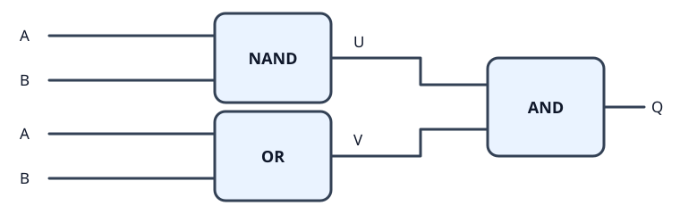

```text
U = NAND(A, B)
V = OR(A, B)
Q = AND(U, V)
```

| A | B | U = NAND(A, B) | V = OR(A, B) | Q = AND(U, V) |
| --- | --- | --- | --- | --- |
| F | F | T | F | F |
| F | T | T | T | T |
| T | F | T | T | T |
| T | T | F | T | F |

一句话读这条电路：**至少有一个真，并且不能两个都真。** 两个条件之间的「并且」，正好对应最后的 AND。

#### 从零逐行构造，也能得到答案

如果还看不出上面的搭配，就先分别认出目标为 `T` 的两行：

- `A = T、B = F`：用 `AND(A, NOT(B))`。A 本身检查「A 为真」，NOT(B) 检查「B 为假」，AND 要求两件事同时成立。
- `A = F、B = T`：用 `AND(NOT(A), B)`，道理相同。

两种情况只要满足一种，最终就应该输出 `T`，所以最后接 OR：

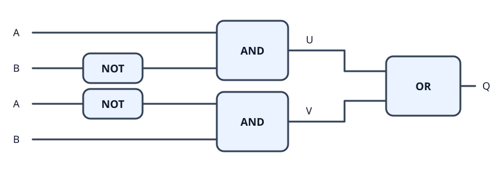

```text
U = AND(A, NOT(B))
V = AND(NOT(A), B)
Q = OR(U, V)
```

| A | B | U：A 真、B 假 | V：A 假、B 真 | Q = OR(U, V) |
| --- | --- | --- | --- | --- |
| F | F | F | F | F |
| F | T | F | T | T |
| T | F | T | F | T |
| T | T | F | F | F |

这条电路用了五只门，最长经过 NOT、AND、OR 三级；前面的解法是三只门、最长两级。逐行构造的价值在于：即使暂时看不出巧妙组合，也能先得到一条正确电路，再继续化简。

### 第 3 题：用给定的门搭出 AND

**题目：** 可用 XNOR、XOR、NOR、OR、NOT，以及固定高、低电平。要求只有两路都为 `T` 时输出 `T`。

#### 先列出可用门和目标

| A | B | XNOR | XOR | NOR | OR | 目标 AND |
| --- | --- | --- | --- | --- | --- | --- |
| F | F | T | F | T | F | F |
| F | T | F | T | F | T | F |
| T | F | F | T | F | T | F |
| T | T | T | F | F | T | T |

我的解法是 XNOR 与 NOR 接收同一对输入，再把输出送入 XOR。可以从 XNOR 多出来的那一行入手：

1. XNOR 会在 `F、F` 和 `T、T` 两行输出 `T`，其中最后一行是目标，第一行多余。
2. NOR 恰好只在多余的第一行输出 `T`。
3. 如果最后用 XOR，第一行的两个 `T` 会得到 `F`；最后一行的 `T、F` 则得到 `T`。
4. 中间两行都是 `F、F`，XOR 仍输出 `F`。于是只留下最后一行。

#### 最终电路与验证

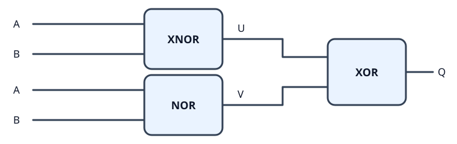

```text
U = XNOR(A, B)
V = NOR(A, B)
Q = XOR(U, V)
```

| A | B | U = XNOR(A, B) | V = NOR(A, B) | Q = XOR(U, V) |
| --- | --- | --- | --- | --- |
| F | F | T | T | F |
| F | T | F | F | F |
| T | F | F | F | F |
| T | T | T | F | T |

这里用到了 XOR 的「不同才真」：XNOR 与 NOR 只有在最后一行不同，所以最终只有最后一行为真。

也可以把它理解成用 NOR 把 XNOR 多选的 `F、F` 那一行翻回去。但这样理解有一个前提：NOR 为真的行本来就在 XNOR 为真的行里。如果换成别的两列，XOR 也可能把原来为假的行翻成真，仍要逐行核对。

#### 另一条思路：把「两个都真」变成「两个都假」

先把两路输入取反，再接 NOR：

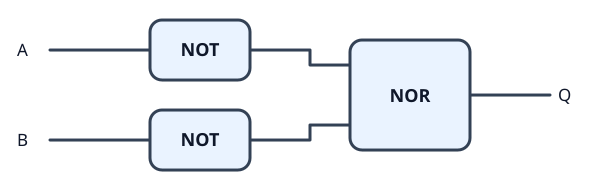

```text
Q = NOR(NOT(A), NOT(B))
```

原输入都是 `T` 时，两个 NOT 输出 `F、F`，NOR 才输出 `T`；原输入只要有一路为 `F`，取反后就有一路为 `T`，NOR 便输出 `F`。同样是三只门、最长两级。

### 第 4 题：用给定的门搭出 NAND

**题目：** 可用 XNOR、XOR、NOR、OR、NOT，以及固定高、低电平。要求只有两路都为 `T` 时输出 `F`，其他情况输出 `T`。

#### 先列出可用门和目标

| A | B | XNOR | XOR | NOR | OR | 目标 NAND |
| --- | --- | --- | --- | --- | --- | --- |
| F | F | T | F | T | F | T |
| F | T | F | T | F | T | T |
| T | F | F | T | F | T | T |
| T | T | T | F | F | T | F |

我的解法是 XOR 与 NOR 接收同一对输入，再把输出送进 OR。这里可以把目标为真的三行分成两组：

1. 中间两行是一真一假，XOR 正好认出这两行。
2. 剩下的第一行是两个都假，NOR 正好认出这一行。
3. 这两组中只要命中一组，就该输出 `T`，所以用 OR 合起来。
4. 最后一行两组都没命中，XOR、NOR 都给出 `F`，最终 OR 也给出 `F`。

#### 最终电路与验证

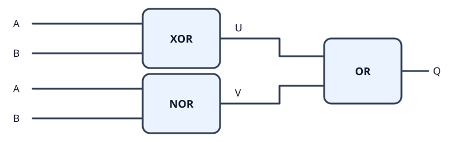

```text
U = XOR(A, B)
V = NOR(A, B)
Q = OR(U, V)
```

| A | B | U = XOR(A, B) | V = NOR(A, B) | Q = OR(U, V) |
| --- | --- | --- | --- | --- |
| F | F | F | T | T |
| F | T | T | F | T |
| T | F | T | F | T |
| T | T | F | F | F |

也就是：**一真一假，或者两个都假。** 这三种情况合起来，正好是「除了两个都真以外」。

#### 另一条思路：直接判断「至少有一路是假」

NAND 在「至少一路为 `F`」时输出 `T`。先取反，`NOT(A)` 就表示「A 是假」，`NOT(B)` 表示「B 是假」；两者只要有一个成立即可，所以接 OR：

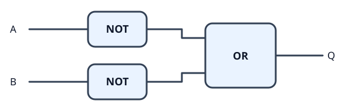

```text
Q = OR(NOT(A), NOT(B))
```

只有原输入为 `T、T` 时，两个 NOT 才同时输出 `F`，使最终 OR 输出 `F`。这仍是三只门、最长两级。

### 第 5 题：用给定的门搭出 XNOR

**题目：** 可用 NOR、NAND、OR、AND、NOT，以及固定高、低电平。要求两路输入相同时输出 `T`，不同时输出 `F`。

#### 先列出可用门和目标

| A | B | NOR | NAND | OR | AND | 目标 XNOR |
| --- | --- | --- | --- | --- | --- | --- |
| F | F | T | T | F | F | T |
| F | T | F | T | T | F | F |
| T | F | F | T | T | F | F |
| T | T | F | F | T | T | T |

我的解法是 NOR 与 AND 接收同一对输入，再把输出送进 OR。把「相同」拆开，就自然得到这条电路：

1. 两路相同，有「两个都假」和「两个都真」两种情况。
2. NOR 只认出「两个都假」。
3. AND 只认出「两个都真」。
4. 满足任意一种都算相同，所以用 OR 合起来。

#### 最终电路与验证

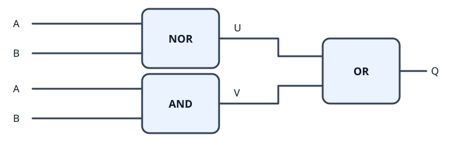

```text
U = NOR(A, B)
V = AND(A, B)
Q = OR(U, V)
```

| A | B | U = NOR(A, B) | V = AND(A, B) | Q = OR(U, V) |
| --- | --- | --- | --- | --- |
| F | F | T | F | T |
| F | T | F | F | F |
| T | F | F | F | F |
| T | T | F | T | T |

两条支路各负责一种相同情况，OR 汇总它们的判断。这种「先拆成几种情况，再合起来」的做法，在第 4 题中也用到了。

#### 另一条思路：把第 2 题的最终结果取反

第 2 题已经得到：

```text
XOR(A, B) = AND(OR(A, B), NAND(A, B))
```

XNOR 要把这个结果取反，因此可以直接把最后的 AND 换成 NAND：


```text
U = OR(A, B)
V = NAND(A, B)
Q = NAND(U, V)
```

一真一假时，U、V 都为 `T`，最后的 NAND 给出 `F`；两路相同时，U、V 中总有一个为 `F`，最后给出 `T`。这样把「AND 后再 NOT」合成了一只 NAND，总数仍为三只门、最长两级。

### 把几种解题方法整理一下

#### 方法一：按条件拆开，再选门连接

先用一句话写出目标，然后把「并且」「或者」「相同」「不同」这些关系对应到门上：

- 两个条件必须同时满足：AND。第 2 题是「至少一个真，并且不能两个都真」。
- 两种情况满足任意一种：OR。第 4 题是「一真一假，或者两个都假」；第 5 题是「两个都假，或者两个都真」。
- 两个中间判断只在目标行不同：XOR。第 3 题就是比较 XNOR 与 NOR。
- 两个中间判断只在非目标行不同：XNOR。第 1 题就是比较 XOR 与 NAND。

列真值表以后，先尝试给某一列为 `T` 的那些行起一个含义明确的名字，例如「两个都假」。这样会更容易看出目标条件与它之间的关系。

#### 方法二：逐行构造，先得到一定正确的表达式

这个方法适用于输出只由当前输入决定的布尔函数：

1. 找出目标输出为 `T` 的每一行。
2. 对于其中一行，要求输入为 `T` 的位置直接用原输入，要求为 `F` 的位置用 NOT。
3. 把这些条件用 AND 连起来，得到一个只在该行输出 `T` 的判断。
4. 把所有这样的判断用 OR 合起来。

第 2 题的五门解法就是完整示例：分别匹配 `T、F` 与 `F、T`，然后合并。更一般地，三路、四路输入也可以这样做；只是需要匹配的条件和行数可能更多。若没有任何一行需要输出 `T`，结果就是固定 `F`。

这种形式叫**与或式**；每个 AND 项完整指定所有输入时，称为**主析取范式**。它保证能根据真值表构造出正确函数，但不保证直接得到最少的门。接下来可以用布尔代数或卡诺图合并条件，再换成题目允许的门。[MIT 6.004 的组合逻辑练习](https://ocw.mit.edu/courses/6-004-computation-structures-spring-2009/7ea55998597fbe0100a23f64355be589_MIT6_004s09_tutor05_sol.pdf)也采用了从真值表写出与或式、再化简和实现的步骤。

这里还要看可用门是否足够表达目标。第 2、5 题直接给了 AND、OR、NOT；第 1 题可以用 NAND、NOT 补出 OR；第 3、4 题可以用 NOR、NOT 补出 AND。所以这五题都能凑齐逐行构造需要的三种运算。卡诺图主要帮助化简与或式；有 XOR、XNOR 可选时，还可以继续比较其他结构的门数。

#### 方法三：用等价关系换成手头有的门

最常用的两条是德摩根定律：

```text
NOT(AND(A, B)) = OR(NOT(A), NOT(B))
NOT(OR(A, B))  = AND(NOT(A), NOT(B))
```

第一条读作：「并不是两个都真」，等价于「至少一个是假」。第二条读作：「连一个真的都没有」，等价于「两个都是假」。所以把取反从整个结果移到两个输入时，AND 与 OR 也要互换。

第 1、3、4 题的另一种接法都能从这两条推出。第 5 题则用了更直接的合并：末尾的 AND 再取反，正好是一只 NAND。

#### 方法四：把尝试做成有顺序的搜索

如果暂时看不出条件拆分，可以继续使用真值表，但把试法固定下来：

1. 先记下原输入、常量，以及一只允许的门能算出的列。门的输入不一定非得是 `A、B`，也可以同接 A，或者接入常量。
2. 选两列中间结果，按某个可用末级门的规则逐行计算。若要尝试 NOT，就只选一列。
3. 将结果与目标的四行全部比较，完全一致才算找到答案。
4. 如果没有找到，就继续增加一只门，把已有结果作为新门的可选输入。搜索时连同每列是怎么接出来的一起记录，方便画回电路和统计门数。

例如，第 1 题选 XOR、NAND 两列，再尝试 XNOR，就得到 `F、T、T、T`。第 3 题选 XNOR、NOR 两列，再尝试 XOR，就得到 `F、F、F、T`。这些不是额外的记忆规则，都是把末级门的真值表应用到两列中间值。

两路输入只有四行，所以这种搜索还比较容易管理。输入和门数增加以后，候选接法会快速变多，先做条件拆分和代数化简就更有帮助。

### 五题的结论与门数

五条原解逐行核对后都符合目标：

| 题目 | 两条支路 U、V | 最后接什么 | 整体功能 | 门数 | 最长级数 |
| --- | --- | --- | --- | --- | --- |
| 1 | XOR(A, B)、NAND(A, B) | XNOR(U, V) | OR | 3 | 2 |
| 2 | NAND(A, B)、OR(A, B) | AND(U, V) | XOR | 3 | 2 |
| 3 | XNOR(A, B)、NOR(A, B) | XOR(U, V) | AND | 3 | 2 |
| 4 | XOR(A, B)、NOR(A, B) | OR(U, V) | NAND | 3 | 2 |
| 5 | NOR(A, B)、AND(A, B) | OR(U, V) | XNOR | 3 | 2 |

这里每只允许的门计为一个，NOT 是单输入门，其余都是双输入门；同种门可以重复使用，常量和导线分支不计门数，电路不带反馈。按这个口径，五条原解都已经达到最少的三只门。

这个最少门数结论可以用有限枚举核对：从 `A、B、T、F` 出发，列出一只可用门的所有接法；再把第一只门的输出加入可选输入，列出第二只门的所有接法，连同直接输出原信号的情况一起比较。五题各自的目标都没有出现在这些最多两只门的结果中，而上面的三门电路已经实现目标。

最长两级，是因为一条输入到输出的路径只经过「前面的一只门 → 最后的一只门」，前面的两只门位于不同支路。同样的门数和级数，也不代表真实芯片里的晶体管数、功耗或延迟相同；比较实际速度还要看具体门和连线。

这几题留下的主要方法是：**先明确哪些输入情况要输出真，再为它们建立条件；用门把条件组合起来，最后用完整真值表核对。** 真值表既能帮助找答案，也能检查答案；逐行构造可以保证有路可走，观察条件和使用等价关系则能帮助缩短电路。

## 14. 布尔代数在 CPU 里起什么作用？

这一章从一位输入的真与假开始，最后已经能把几个门组合成一个新的判断。CPU 把这样的逻辑扩展到很多位，并让计算结果参与后续操作。**布尔代数用来描述每一位信号怎样由输入决定，也用来证明两种电路是否等价、能不能化简。**

### 从逻辑判断到算术

一个逻辑位可以表示 `0` 或 `1`。把多位按不同位权排在一起，就可以表示更大的数；而每一位结果和进位，仍然可以写成布尔函数。

只看两位相加、还没有前一级进位的情况：

```text
本位结果 S = XOR(A, B)
向高位的进位 C = AND(A, B)
```

例如 `1 + 1` 时，XOR 给出本位的 `0`，AND 给出进位的 `1`，合起来就是二进制 `10`。熟悉的两个门，已经能一起表达最简单的加法。继续处理来自低位的进位，再把各位连接起来，就能逐步构成多位加法器。加法、减法、比较和按位运算，都是后面算术逻辑单元（ALU）的基础。

### 从当前输出到保存结果

前面这些不带反馈的组合电路，在输入稳定后，输出只由当前输入决定。CPU 还需要保留上一步的结果：例如累加时，下一次相加必须能拿到之前的和。

这就需要存储状态。锁存器、触发器等电路可以保存位；若干位组成寄存器，再配合选择和读写控制，就能组织起更大的存储结构。布尔逻辑负责描述何时写入、选中哪里、送出哪个值；可靠地保存和更新状态，还要考虑电路结构与时序。[MIT 的时序逻辑讲义](https://computationstructures.org/notes/sequential_logic/notes.html)用累加的例子解释了为什么计算必须与状态结合。

因此，布尔代数是理解存储器的重要基础；具体采用什么电路保存每一位，则还涉及存储技术本身。

### 从几块电路到执行指令

CPU 还需要决定这次做加法还是逻辑运算、从哪里取数、把结果写到哪里、接着执行哪条指令。选择器、译码器和控制逻辑承担这些判断，它们同样建立在布尔函数之上。

可以把这一章与后面的内容连成三条线：

| 布尔逻辑继续组合 | 形成的能力 | 在 CPU 中的作用 |
| --- | --- | --- |
| 计算结果位、进位和比较条件 | 算术与逻辑运算 | 处理数据、计算地址、判断条件 |
| 与保存状态的电路及读写控制结合 | 寄存器与存储结构 | 保留数据和执行进度 |
| 译码指令、选择数据、控制更新 | 数据通路与控制 | 让各部件按指令要求配合工作 |

到这里，第一篇记下了从真值表理解逻辑、组合电路和验证结果的方法。接下来把一位扩成多位，把一次计算扩成可以保存结果的连续计算，就开始从逻辑门走向 CPU 的组成了。
