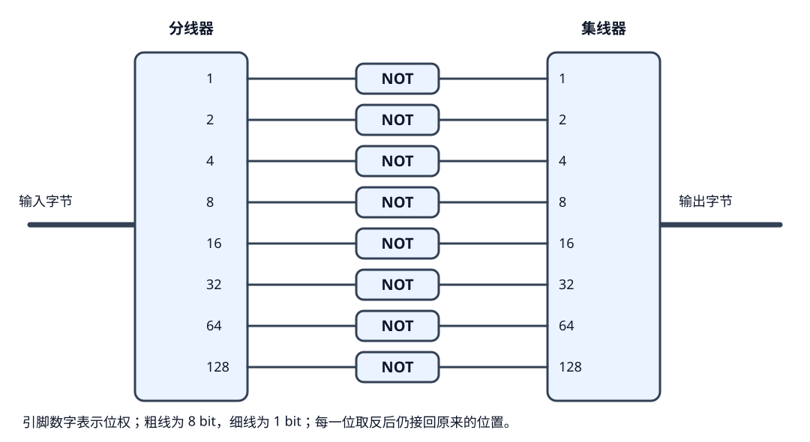
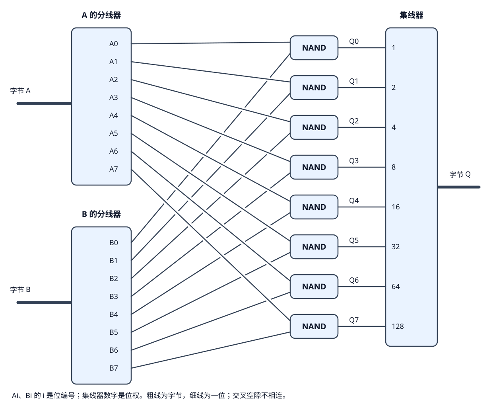
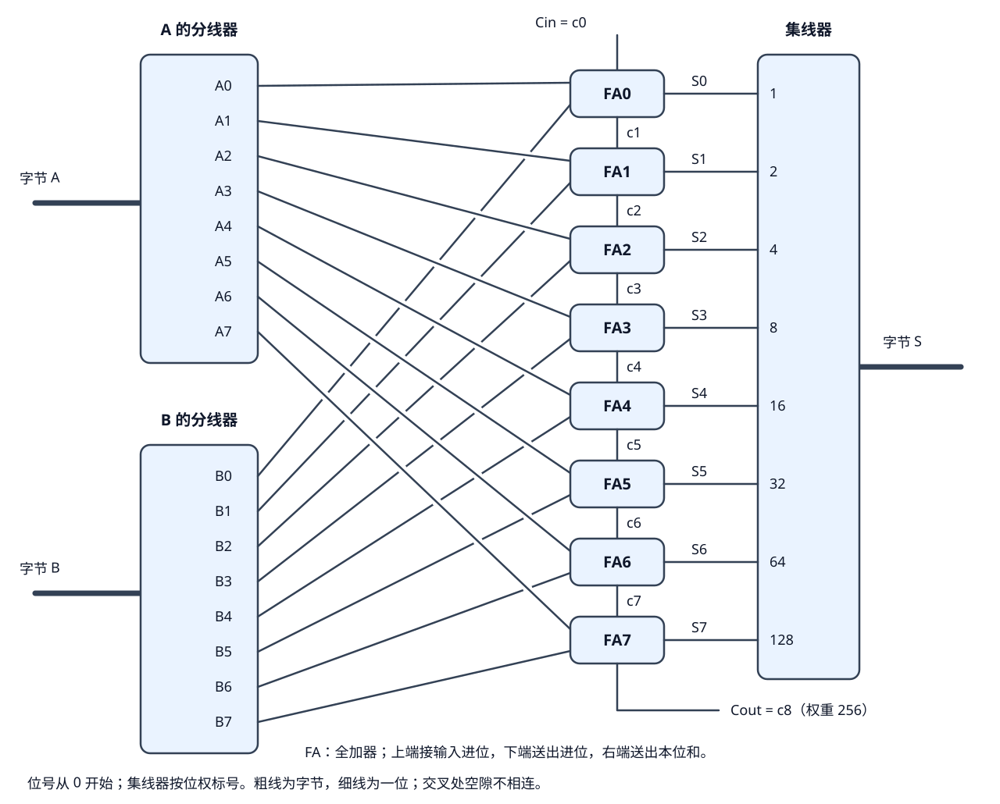
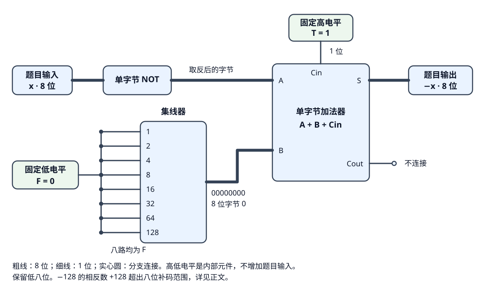

# 第五篇：从单字节运算到补码与负数

[上一篇](第四篇学习日志.md)从条件判断讲到加法器，再用分线器和集线器完成一个字节的翻倍。这一篇继续把字节作为整体处理，先从每一位独立进行的逻辑运算开始。

与本篇并行的是[第六篇：反馈、时序与数据控制](第六篇学习日志.md)：[反馈](第六篇学习日志.md#1-循环依赖现实电路允许输出接回输入吗)讨论输出怎样影响已有状态，[两周期延迟](第六篇学习日志.md#3-晚点到站把输入延迟两个周期)讨论怎样把本次输入留到后续周期输出。这里计算各位的值，那里处理这些值怎样保存和更新。

两篇共用的选路知识见第六篇的[二进制开关：用两个 NOT 和两个开关搭出 XOR](第六篇学习日志.md#5-二进制开关用两个-not-和两个开关搭出-xor)，其中说明了高阻态、共享输出线，以及按控制信号选择数据的方法。

## 1. 单字节非门：把八个位分别取反

输入是一个字节，输出也是一个字节，要求对输入的每一位取反。

这里“取反”的规则和前面的一位 NOT 完全一样：

| 某一位的输入 | 同一位置的输出 |
| --- | --- |
| F，也就是 0 | T，也就是 1 |
| T，也就是 1 | F，也就是 0 |

只是现在要同时处理八个位。因此，**把字节拆成八路，每一路接一个 NOT，再按原来的位置合起来就可以了。**

### “1～128 的各位”指什么？

分线器和集线器上的 1、2、4、8、16、32、64、128，是八个位的权重。每根拆出来的线本身仍然只携带 0 或 1。

例如，权重 32 的那根线为 1，表示这一位对整个数贡献 32；为 0，就不贡献这个 32。把这根线接入 NOT，只是把它的 0、1 翻转，并不是把数字 32 单独拿去做某种运算。

### 逐位算一次：输入 5 会变成什么？

5 写成八位二进制是 `00000101`。把每一列分别取反：

| 位权 | 128 | 64 | 32 | 16 | 8 | 4 | 2 | 1 |
| --- | --- | --- | --- | --- | --- | --- | --- | --- |
| 输入 | 0 | 0 | 0 | 0 | 0 | 1 | 0 | 1 |
| 经过 NOT 后 | 1 | 1 | 1 | 1 | 1 | 0 | 1 | 0 |

所以输出是 `11111010`。仍按无符号整数读：

```text
11111010 = 128 + 64 + 32 + 16 + 8 + 2 = 250
```

没有进位，没有借位，也没有把某一位挪到别的位置。每个输出只看与自己对应的那个输入。

### 完整接线



接线按位权一一对应：

```text
输入的 1   → NOT → 输出的 1
输入的 2   → NOT → 输出的 2
输入的 4   → NOT → 输出的 4
输入的 8   → NOT → 输出的 8
输入的 16  → NOT → 输出的 16
输入的 32  → NOT → 输出的 32
输入的 64  → NOT → 输出的 64
输入的 128 → NOT → 输出的 128
```

需要一个分线器、八个单比特 NOT、一个集线器。八个 NOT 在八条并行支路上，每一位经过一只 NOT，不是把八只 NOT 串在同一根线上。

上一题翻倍把输入接到更高一位；这一题保持位的位置，改变的是每一位的值。

### 为什么 5 取反后是 250？

八个位的全部权重相加是 255：

```text
128 + 64 + 32 + 16 + 8 + 4 + 2 + 1 = 255
```

输入占了哪些权重，取反后的输出就不占；输入没占的权重，输出全部补上。两者恰好把这八个位的权重分完，所以：

```text
八位无符号输入 x：取反后的数值 = 255 − x
```

输入 5 占用了 4 和 1，取反后就占用其余权重，得到 255 − 5 = 250。这是用数值解释和核对结果的方法，实际接线中并没有放一个减法器。

“八位”这个限制很重要。同一个 5 写成四位是 `0101`，取反得到 `1010`，数值为 10；写成八位再取反才得到 250。所以需要先确定有多少位，再谈整个数取反后的值。

### 为什么需要这个功能？

一个字节不一定只用来表示一个数量，也可以同时表示八个独立的状态。例如用八个位控制八盏灯，1 表示亮、0 表示灭。若要让原来亮的灭掉、原来灭的亮起，对八个位分别取反就完成了。

类似地，如果用 1 标记“选中的位置”，NOT 可以得到“未选中的位置”：

```text
原来选中：00111100
其余位置：11000011
```

这样的位串常叫作掩码，可以把它理解成“哪些位置需要处理”的标记。后面与按位 AND、OR 等运算配合，就能选择、清除或设置数据中的某些位。

取反也会参与减法电路。以八位运算为例，计算 9 − 5 时，可以把 5 逐位取反得到 250，再做：

```text
9 + 250 + 1 = 260
260 = 256 + 4
```

只保留结果的低八位，去掉代表 256 的第九位，就留下 4，正好是 9 − 5。完整的表示规则和进位处理，留到单字节减法时推导；这里先看到，取反可以和加法器配合完成另一种运算。

**按位取反与算术上的取负，要分清楚。** 这一节按八位无符号数解释输入、输出，5 取反得到的是 250，不是 −5。后面若用八位补码表示负数，“取反后再加 1”才是构造相反数位模式的方法；这比单独经过 NOT 多了加 1 的步骤。

所以，单字节 NOT 是一个可以反复使用的基本运算部件。它的作用由后续电路怎样使用这八个输出位决定。

### 核对几组输入

| 输入（十进制） | 输入（二进制） | 输出（二进制） | 输出（十进制） |
| --- | --- | --- | --- |
| 0 | 00000000 | 11111111 | 255 |
| 5 | 00000101 | 11111010 | 250 |
| 85 | 01010101 | 10101010 | 170 |
| 127 | 01111111 | 10000000 | 128 |
| 128 | 10000000 | 01111111 | 127 |
| 255 | 11111111 | 00000000 | 0 |

按八条支路的 NOT 规则枚举 0～255，共 256 种输入，输出都等于 255 − 输入。再对结果取反一次，也都会回到原输入，因为每个位都经历了两次翻转。

## 2. 单字节与非门：两个字节的对应位分别做 NAND

这次有两个字节输入 A、B，输出一个字节 Q。先用两个分线器分别拆开 A、B，然后让相同位置的两位进入同一只 NAND，最后把八个结果合成一个字节。

第 0 位就是最低位，权重为 1；第 7 位是最高位，权重为 128。位编号与位权不是同一个数字：第 2 位的权重是 4。

### 每一对输入，仍然只按一位 NAND 的规则计算

“与非”就是先判断两路是否都为 1，再把结果取反：只有两个输入都为 1，输出才为 0。

| A 的某一位 | B 的同一位 | Q 的同一位 |
| --- | --- | --- |
| 0 | 0 | 1 |
| 0 | 1 | 1 |
| 1 | 0 | 1 |
| 1 | 1 | 0 |

给八个位置分别套用这个规则，就得到整条电路：

```text
Q0 = NAND(A0, B0)    权重 1
Q1 = NAND(A1, B1)    权重 2
Q2 = NAND(A2, B2)    权重 4
Q3 = NAND(A3, B3)    权重 8
Q4 = NAND(A4, B4)    权重 16
Q5 = NAND(A5, B5)    权重 32
Q6 = NAND(A6, B6)    权重 64
Q7 = NAND(A7, B7)    权重 128
```

这里 A0 表示 A 的第 0 位，其他名字同理。某一对输入只影响对应的一位输出；各位之间没有进位，也不用汇总成一个总的真假判断。

### 完整接线



需要两个分线器、八个单比特 NAND、一个集线器。图里的 A0、B0 都接到计算 Q0 的那只 NAND，A1、B1 都接到计算 Q1 的那只，以此类推。交叉处留出的空隙表示导线不相连。

最后把 Q0 接到集线器权重 1 的引脚，Q1 接权重 2 的引脚，一直接到 Q7 对应的权重 128。八只门并行工作，每条输入到对应输出的路径只经过一只 NAND。

### 用两个字节逐位算一次

例如 A = 204，B = 170。先写成八位二进制，再按列计算：

```text
位权：   128  64  32  16   8   4   2   1
A：       1   1   0   0   1   1   0   0
B：       1   0   1   0   1   0   1   0
AND：     1   0   0   0   1   0   0   0
取反 Q：  0   1   1   1   0   1   1   1
```

- 权重 128、8 的两列，A、B 都为 1，所以 NAND 输出 0。
- 其余六列都没有同时出现两个 1，所以 NAND 输出 1。包括权重 16、1 这两列的 0、0，NAND 也要输出 1。

最后 Q = `01110111`，数值是 `64 + 32 + 16 + 4 + 2 + 1 = 119`。

表里的 AND 一行只是把“先与后非”的计算展开，实际接线直接使用 NAND，不需要另外增加八只 AND 和八只 NOT。

### 实际有什么用？

单字节 NAND 的用途，可以从它表达的条件理解：**把两个字节中同时为 1 的位置标成 0，其余位置标成 1。**

例如有八个受控部件，每个位对应一个部件：A 中的 1 表示“允许这个部件运行”，B 中的 1 表示“这次请求它运行”。再假设后面的控制端采用 0 表示允许运行、1 表示禁止运行，那么 NAND 就能直接给出控制信号：

| 是否允许 A 的这一位 | 是否请求 B 的这一位 | 输出控制位 Q | 含义 |
| --- | --- | --- | --- |
| 0 | 0 | 1 | 禁止运行 |
| 0 | 1 | 1 | 禁止运行 |
| 1 | 0 | 1 | 禁止运行 |
| 1 | 1 | 0 | 允许运行 |

把八组这样的判断放在一起，就是单字节 NAND。比如按高位在左的顺序写：

```text
A：00001111    第 0、1、2、3 位允许
B：00111100    第 2、3、4、5 位有请求
Q：11110011    只有第 2、3 位输出 0，允许运行
```

用低电平表示某个功能被启用，叫作低电平有效。上面是按这种约定构造的例子；如果接收端用 1 表示运行，需要的判断就是 AND。选哪一种门，要看后面需要什么信号含义。

在搭计算电路时，单字节 NAND 也能作为可复用的组成部分：它把一位 NAND 的规则同时应用到八个位。具体 CPU 是否把 NAND 单独列为一条指令，要看指令集；这里先掌握的是这个硬件运算怎样实现，以及怎样和其他部件配合。

### 用固定输入核对它与 NOT 的关系

如果 B 的八个位全是 1，每一只 NAND 都变成 `NAND(A 的这一位, 1)`，输出就等于 A 这一位的 NOT。所以 A 与 `11111111` 做按位 NAND，效果就是对 A 的八个位全部取反。

如果 B 的八个位全是 0，每一只 NAND 都至少收到一个 0，八个输出就全为 1，结果是 `11111111`。

这两种边界情况也能帮助查错：

| A | B | 按位 NAND 的输出 |
| --- | --- | --- |
| 00000000 | 00000000 | 11111111 |
| 11111111 | 11111111 | 00000000 |
| 00000101 | 11111111 | 11111010 |
| 11001100 | 10101010 | 01110111 |

两个字节一共有 `256 × 256 = 65536` 种输入组合。按八对同位输入分别计算 NAND，再合并，全部结果都与“先按位 AND，再将八个位取反”一致。

## 3. 单字节加法：把八个全加器用进位串起来

### 题目：设计一个带输入进位的八位加法器

已知电路有三个输入接口、两个输出接口。所有信号中，F 表示 0，T 表示 1；字节按无符号整数解释，也就是表示 0～255，不包含负数。

| 方向 | 接口名称 | 本文记号 | 宽度 | 含义 |
| --- | --- | --- | --- | --- |
| 输入 | A | A | 8 位 | 第一个加数，范围 0～255 |
| 输入 | B | B | 8 位 | 第二个加数，范围 0～255 |
| 输入 | 输入进位 | Cin | 1 位 | 额外加上的 0 或 1，由外部给出 |
| 输出 | 输出 | S | 8 位 | 完整结果的低八位 |
| 输出 | 输出进位 | Cout | 1 位 | 完整结果的第九位，表示是否达到 256 |

接口旁的“8”和“1”标记导线能承载多少位，不是这次参与计算的数值。两个字节加一个进位，共有三个输入接口；两个输出接口需要由电路算出结果。

**要求：** 利用分线器、集线器以及全加器结构搭建电路，使任意合法输入都满足以下规则。记完整结果为 N：

```text
N = A + B + Cin

当 N < 256 时：S = N，      Cout = 0
当 N ≥ 256 时：S = N - 256，Cout = 1
```

这里给出的是一种搭建方案所用的结构，不额外假设题目限制了元件数量。需要完成三个步骤：先弄清进位的含义，再确定每一位怎么算，最后连接八个位的电路。

### 先理解输入进位：这次还要不要额外加 1？

Cin 不是另一个字节，只表示本次还要不要额外加 1。它为 F，就加 0；它为 T，就加 1。

| A | B | Cin | 实际计算 | 完整结果 |
| --- | --- | --- | --- | --- |
| 5 | 3 | 0 | 5 + 3 + 0 | 8 |
| 5 | 3 | 1 | 5 + 3 + 1 | 9 |

为什么把这个额外的 1 叫“进位”？先看熟悉的十进制竖式 `27 + 15`：

```text
个位：7 + 5 = 12，个位留下 2，向十位送出 1。
十位：2 + 1 + 个位送来的 1 = 4。
结果：42。
```

站在十位的角度，它不仅要加两个十位数字，还要接收个位送来的 1。这个从低位送进来的数，就是十位的“输入进位”。个位把它送出去，所以同一个信号又是个位的“输出进位”。

二进制也是这样，只是逢 2 进 1。例如 `1 + 1 = 10`，本位留下 0，向高一位送出 1。本题把八个位合成一个加法器后，也保留了接收和送出进位的接口，方便以后连接更宽的加法器。

**Cin 是计算开始时给定的输入，Cout 是本次计算得到的输出。** Cin 为 1 不代表 Cout 一定为 1：上面的 `5 + 3 + 1 = 9` 就没有超出一个字节，Cout 仍然是 0。它也不是本次加法“上一个周期”的结果；本题没有要求保存历史值。

只算独立的 A + B 时，可以令 Cin = 0；但题目专门提供了这个输入，所以搭建的电路必须同时处理 Cin = 0 和 Cin = 1。

### 输出字节和输出进位，怎样一起表示结果？

一个字节最多表示 255。如果完整结果超过 255，就把第九位通过 Cout 单独送出去，S 保存低八位：

```text
完整结果 = S + 256 × Cout
```

例如 255 + 1 = 256，二进制是 `1 00000000`：S 输出 `00000000`，Cout 输出 T。若只看 S，会误以为结果是 0；把权重为 256 的 Cout 算上，才得到完整的 256。

最大可能的结果是 255 + 255 + 1 = 511，二进制为 `1 11111111`，九位正好装得下。因此，一个输出字节加一个输出进位就够了。

### 每一位，其实就是一道全加器题

把 A、B 分别拆成 A0～A7、B0～B7，其中第 0 位是最低位，权重为 1。每一位要处理三个输入：

1. A 在这一位的值。
2. B 在这一位的值。
3. 从低一位送来的进位。

这就是[第四篇的全加器](第四篇学习日志.md#5-全加器把第三路输入也加进来)。它把这三个 0 或 1 相加，给出本位和与向高位的进位。

注意，“这一位的输出是三个输入之和”要分成两个输出理解：如果三者合计是 2 或 3，一根本位输出线放不下，就要同时使用进位线。

| 三个输入的数值之和 | 本位和 | 送往高一位的进位 |
| --- | --- | --- |
| 0 | 0 | 0 |
| 1 | 1 | 0 |
| 2 | 0 | 1 |
| 3 | 1 | 1 |

### 最低位从哪里取得进位？

最低位没有更低一位的全加器，所以它的第三个输入接题目给出的 Cin。

这里不能把最低位的进位输入固定为 F，也不能只用一个不接收进位的半加器代替它。那样只能计算 A + B，会漏掉题目要求的外部 Cin。

将各级之间的进位命名为 c0～c8：c0 就是外部 Cin，c8 就是最终 Cout。

| 全加器 | 三个输入 | 本位和接哪里 | 进位接哪里 |
| --- | --- | --- | --- |
| FA0，计算权重 1 的位 | A0、B0、c0 = Cin | S0 → 集线器权重 1 | c1 → FA1 |
| FA1，计算权重 2 的位 | A1、B1、c1 | S1 → 集线器权重 2 | c2 → FA2 |
| FA2，计算权重 4 的位 | A2、B2、c2 | S2 → 集线器权重 4 | c3 → FA3 |
| FA3，计算权重 8 的位 | A3、B3、c3 | S3 → 集线器权重 8 | c4 → FA4 |
| FA4，计算权重 16 的位 | A4、B4、c4 | S4 → 集线器权重 16 | c5 → FA5 |
| FA5，计算权重 32 的位 | A5、B5、c5 | S5 → 集线器权重 32 | c6 → FA6 |
| FA6，计算权重 64 的位 | A6、B6、c6 | S6 → 集线器权重 64 | c7 → FA7 |
| FA7，计算权重 128 的位 | A7、B7、c7 | S7 → 集线器权重 128 | c8 → 外部 Cout |

FA 是 full adder，也就是全加器。八个 FA 的内部规则完全相同，编号只是说明它负责哪一位。图中按数据与进位的功能标出连接，实际放置元件时按它的引脚标识对应。

### 完整接线



接线时可以分三遍检查：

1. **接数据：** 两个分线器分别拆开 A、B，把相同位号的 Ai、Bi 接到同一个 FA。
2. **接进位：** 外部 Cin → FA0；FA0 的进位 → FA1；依次连到 FA7，最后的进位接外部 Cout。
3. **接结果：** 八个 FA 的本位和 S0～S7 接到集线器的对应位，合成输出字节 S。

全加器块可以使用已有的全加器元件；如果需要展开内部，就复用第四篇的两个 XOR、两个 AND、一个 OR 结构。逻辑上是两个分线器、八个全加器和一个集线器，Cin、Cout 是另外的一位信号线。

### 逐位算一次：255 + 1 + 输入进位 1

先写出输入：

```text
A   = 11111111 = 255
B   = 00000001 = 1
Cin = 1
```

从最低位往最高位走，每一行使用上一行产生的进位：

| 位号 i | Ai | Bi | 本位收到的 ci | 三个输入相加 | 本位和 Si | 送出的 c(i+1) |
| --- | --- | --- | --- | --- | --- | --- |
| 0 | 1 | 1 | 1 | 3，即二进制 11 | 1 | 1 |
| 1 | 1 | 0 | 1 | 2，即二进制 10 | 0 | 1 |
| 2 | 1 | 0 | 1 | 2，即二进制 10 | 0 | 1 |
| 3 | 1 | 0 | 1 | 2，即二进制 10 | 0 | 1 |
| 4 | 1 | 0 | 1 | 2，即二进制 10 | 0 | 1 |
| 5 | 1 | 0 | 1 | 2，即二进制 10 | 0 | 1 |
| 6 | 1 | 0 | 1 | 2，即二进制 10 | 0 | 1 |
| 7 | 1 | 0 | 1 | 2，即二进制 10 | 0 | 1 |

表格从低位到高位列出，所以把 S7 到 S0 反向读回来，输出字节是 `00000001`，数值为 1。最后一行的进位 c8 = 1，也就是 Cout = T。

```text
完整输出：1 00000001
          ↑ └─ S = 1
          Cout = 1，权重为 256

1 + 256 × 1 = 257 = 255 + 1 + 1
```

### 和按位 NAND 的接法有什么区别？

[按位 NAND](#2-单字节与非门两个字节的对应位分别做-nand)的八组输入可以各算各的，一位的结果不会改变另一位。加法则要把低位凑出来的进位送到高位，因此多了这条从 c0 一直走到 c8 的联系。

这种让进位逐级传播的结构叫逐位进位加法器，也叫行波进位加法器。输入改变后，高位可能需要等低位的进位传播过来，最终输出才稳定。

这里的“逐级传播”不是每一级等待一个时钟周期，八个全加器也不意味着要等八拍。它仍然是组合逻辑中的传播延迟，与第六篇[用存储部件延迟两个周期](第六篇学习日志.md#3-晚点到站把输入延迟两个周期)不同。

### 输入、输出进位为什么都要保留？

它们让多个字节的加法器可以接起来：计算两个更宽的数时，低字节加法器的 Cout 可以作为高字节加法器的 Cin。低字节算不下的那一个进位，就交给高字节继续算。

如果只需要计算两个独立字节的 A + B，可以把外部 Cin 设为 0。但本题要求也能接收 Cin = 1，所以电路需要保留这条输入通路。

### 核对结果与边界

| A | B | Cin | 完整结果 | S（低八位，十进制） | Cout |
| --- | --- | --- | --- | --- | --- |
| 0 | 0 | 0 | 0 | 0 | F |
| 0 | 0 | 1 | 1 | 1 | F |
| 5 | 3 | 0 | 8 | 8 | F |
| 127 | 1 | 1 | 129 | 129 | F |
| 255 | 0 | 1 | 256 | 0 | T |
| 255 | 1 | 1 | 257 | 1 | T |
| 255 | 255 | 1 | 511 | 255 | T |

按八级全加器逐位计算，枚举两个字节与 Cin 的 `256 × 256 × 2 = 131072` 种输入，均满足 `A + B + Cin = S + 256 × Cout`。这里核对的是接线所表示的逻辑；尚未记录实际关卡运行结果。

## 4. 负数：用八位补码表示小于零的数

### 题目与位权

给定一个 −128～−1 的整数，选择八个位中的若干位，使选中位的权重之和等于这个负数。选中写作 1，未选中写作 0。

前面把字节解释为无符号数时，八个位从左到右的权重是：

```text
128   64   32   16   8   4   2   1
```

现在使用八位补码，权重改成：

```text
−128  64   32   16   8   4   2   1
```

**只有最高位的权重从 128 变成了 −128。** 这里“最高位”指位置最高，不是说 −128 的数值最大；−128 是八位补码能表示的最小值。这一位按从 0 开始的位号叫第 7 位，按从 1 开始计数则是第 8 位。

导线上仍然只有八个 0 或 1，没有多出一根负号线。变化的是解释这八个位的方法：每个位为 1 时，加上它的权重；为 0 时，加上 0。

### 从 −5 开始：先有 −128，再往回加

要拼出负数，最高位必须选中：其余七个位的权重都是正数，单靠它们加不出负数。

选中最高位后，当前值是 −128。要到 −5，还需要增加多少？

```text
−5 − (−128) = 123
```

接下来就是熟悉的正数二进制题：用 64、32、16、8、4、2、1 凑出 123。

| 考虑的权重 | 是否选中 | 还需要凑出的数 |
| --- | --- | --- |
| 64 | 选，123 − 64 | 59 |
| 32 | 选，59 − 32 | 27 |
| 16 | 选，27 − 16 | 11 |
| 8 | 选，11 − 8 | 3 |
| 4 | 不选，4 比 3 大 | 3 |
| 2 | 选，3 − 2 | 1 |
| 1 | 选，1 − 1 | 0 |

把最高位和这些选择放回同一行：

```text
权重：−128  64  32  16   8   4   2   1
位值：   1   1   1   1   1   0   1   1

−128 + 64 + 32 + 16 + 8 + 2 + 1 = −5
所以 −5 的八位补码是 11111011。
```

通用做法是：**目标为负数 n 时，先选 −128，再用剩余七位表示 128 + n。** 比如目标是 −100，剩余部分就是 28；28 = 16 + 8 + 4，因此得到 `10011100`。

### 为什么范围是 −128～127？

最高位为 0 时，剩余七位从全部不选到全部选中，可以表示 0～127。

最高位为 1 时，数值就是 −128 加上 0～127，因此可以表示 −128～−1。

| 八个位 | 按补码解释的计算 | 数值 |
| --- | --- | --- |
| `00000000` | 0 | 0 |
| `01111111` | 64 + 32 + 16 + 8 + 4 + 2 + 1 | 127 |
| `10000000` | −128 | −128 |
| `10000001` | −128 + 1 | −127 |
| `11111011` | −128 + 123 | −5 |
| `11111110` | −128 + 126 | −2 |
| `11111111` | −128 + 127 | −1 |

最高位能用来判断正负，但不能把它当作一个独立的负号，再把剩余七位读成绝对值。例如 `10000101` 表示 −128 + 5 = −123，不是 −5。

### 同样的八个位，为什么既能表示 251，又能表示 −5？

`11111011` 按前面的无符号规则读，是 128 + 123 = 251；按补码规则读，是 −128 + 123 = −5。

两种解释只在最高位的权重上有区别：128 变成 −128，少了 256。所以，对于最高位为 1 的八位数据：

```text
补码表示的数 = 按无符号规则读出的数 − 256
例如：251 − 256 = −5
```

最高位为 0 时，两种读法相同。这也说明为什么必须先知道数据的解释方式：八个比特本身不会告诉电路“我应该被读成正数还是负数”。

### “取反再加一”为什么也能得到负数？

以前做过的单字节 NOT，现在可以派上用场。以从 5 得到 −5 为例：

```text
5：       00000101
逐位取反：11111010
再加 1：  11111011  → 按八位补码解释，就是 −5
```

其中的道理可以直接用前面的数字说明：

1. 八位全部为 1，按无符号规则读是 255，因此对 5 逐位取反，得到 255 − 5 = 250。
2. 再加 1，得到 251，也就是 256 − 5。
3. 251 的最高位为 1，按补码解释要减去 256，于是 251 − 256 = −5。

因此，对 1～127 中的正整数 x，八位取反再加一，就得到 −x 的补码。位数必须固定：这里所有取反、相加都按八位处理，只保留低八位。

有一个边界要单独记住：八位补码中有 −128，却没有 +128。`10000000` 取反再加一，低八位仍然是 `10000000`；数学上的相反数 +128 超出了可表示范围，不能把这个结果理解为成功表示了 +128。

### 补码和前面的加法器有什么关系？

补码的好处之一是：同一套八位加法电路，也能参与负数运算。先算 `5 + (−5)`：

```text
    00000101   → 5
  + 11111011   → −5
  -----------
  1 00000000
  ↑ └─────── 低八位是 0，正好是 5 + (−5)
  输出进位为 1
```

电路仍然按每位加法、逐位进位的规则工作。在这里，八位补码结果取低八位；左边多出的进位不能再作为权重为 +256 的一位拼回有符号结果。前面 `完整结果 = S + 256 × Cout` 的等式使用的是 A、B 的无符号解释，不能直接套到负数读法上。

也不能用 Cout 单独判断有符号结果是否超出范围。例如：

- `5 + (−5) = 0`：Cout 为 1，但有符号结果没有超出范围。
- `127 + 1`：低八位是 `10000000`，Cout 为 0；按补码读成 −128，但正确数学结果是 +128，已经超出八位补码范围。这叫有符号溢出。

只要数学结果在 −128～127 内，保留下来的八位就能正确表示它；超出范围时，就需要更多位或者另外处理溢出。

这样，前面的几块内容就连起来了：**按位取反提供翻转比特的能力，加法器提供加一和求和的能力，补码规定怎样用这些比特表示负数。** 后面做减法时，就可以沿着“减去一个数，等于加上它的相反数”继续推。

## 5. 数值反转：输出一个数的相反数

### 题目要求

输入、输出各是一个字节，都按八位补码解释。读入 x，输出它的相反数 −x：例如输入 4，输出 −4；输入 −9，输出 9；输入 0，输出仍然为 0。

这里的“反转”是数值变成相反数，不是把八个位倒过来排列，也不是只翻转最高位。比如 4 的补码是 `00000100`，只翻转最高位会得到 `10000100`，按补码读是 −124，并不是 −4。

### 从前面已有的元件入手

上一节已经推导了求相反数的方法：**固定八个位，逐位取反，再加 1。** 现在把这两步交给已有元件：

1. 单字节 NOT 负责同时翻转八个位。
2. 单字节加法器负责给取反结果加 1。

加法器原本计算 `A + B + Cin`，因此可以让 A 接取反结果、B 接字节 0、Cin 接 T。这样就得到了 `取反结果 + 0 + 1`。这里 Cin 正好用来提供需要补上的那个 1。

### 完整接线



图中两端的“题目输入”和“题目输出”对应题目给出的两个八位接口。中间的 A、B、Cin 是加法器元件自己的引脚。固定高电平、固定低电平和集线器都是放在内部的元件，不需要再给题目增加输入接口。

先把固定低电平 F 的一根输出线分成八路，分别接集线器标有 1、2、4、8、16、32、64、128 的输入端。八个位全部为 0，集线器就输出字节 `00000000`，把它接到 B。再把固定高电平 T 接到 Cin，就完成了加法器需要的两个固定输入。图上的实心圆表示同一根 F 线的分支连接点。

| 从哪里接出 | 接到哪里 | 作用 |
| --- | --- | --- |
| 题目的字节输入 | 单字节 NOT 输入 | 接收原数的八个位 |
| 单字节 NOT 输出 | 加法器 A | 提供逐位取反的结果 |
| 八位常量 `00000000` | 加法器 B | 第二个加数为 0 |
| 单位高电平 T | 加法器 Cin | 额外加 1 |
| 加法器八位和 S | 题目的字节输出 | 给出结果的低八位 |
| 加法器 Cout | 不接到题目输出 | 题目只接收八位结果 |

注意 B 是八位输入，Cin 是一位输入。B 应接字节常量 0；若只有单位低电平 F，可以把它分支接到一个集线器的全部八个输入，合成 `00000000` 后再接 B。不要把“数值都等于 0”误解成“一位线和八位线随便互接”，也不要依赖未连接引脚的默认值。

这一方案的运算主体只需要一个单字节 NOT 和一个单字节加法器；八位内部的处理已经封装在这两个元件里，不用重新摆八个一位 NOT 和八个全加器。

### 正数变负数：4 → −4

```text
输入 4：        00000100
逐位取反：      11111011
加 1：          11111100

按补码读取：−128 + 64 + 32 + 16 + 8 + 4 = −4
```

只做 NOT 时得到 `11111011`，其实是 −5；加上 1，才得到需要的 −4。所以数值取相反数不能省掉最后这一步。

### 负数变正数：−9 → 9

−9 可以写成 −128 + 119，其中 119 = 64 + 32 + 16 + 4 + 2 + 1，因此它的输入位模式是 `11110111`。

```text
输入 −9：       11110111
逐位取反：      00001000
加 1：          00001001

按补码读取：8 + 1 = 9
```

可见，不需要额外判断输入是正数还是负数。同一条“逐位取反再加一”的通路，两个方向都适用。

### 0 和 −128 分别会怎样？

0 的情况是：

```text
00000000 → 取反得到 11111111 → 加 1 得到 1 00000000
```

留下低八位 `00000000`，仍然是 0。这里 Cout 为 1，但它不是需要拼进本题结果的第九位。

−128 的情况则是：

```text
10000000 → 取反得到 01111111 → 加 1 得到 10000000
```

结果仍然读作 −128。原因是数学上的相反数 +128 超出了八位补码的上限 127。**任何只有八位补码输出的电路，都无法准确表示 +128。** 若要表示它，需要加宽输出。

题目截图没有说明是否测试 −128、或如何约定这个溢出输入，因此不能据此断言该边界在关卡中如何判分。上述电路在 −127～127 上准确求出相反数；输入 −128 时，给出八位运算保留低八位的结果。

### 核对输出

| 输入数值 | 输入八位 | 输出八位 | 按补码读取输出 |
| --- | --- | --- | --- |
| 4 | `00000100` | `11111100` | −4 |
| −9 | `11110111` | `00001001` | 9 |
| 0 | `00000000` | `00000000` | 0 |
| 1 | `00000001` | `11111111` | −1 |
| −1 | `11111111` | `00000001` | 1 |
| 127 | `01111111` | `10000001` | −127 |
| −127 | `10000001` | `01111111` | 127 |
| −128 | `10000000` | `10000000` | −128，数学上的相反数不可表示 |

枚举全部 256 种输入位模式，按“八位 NOT → 加法器加一 → 保留低八位”核对：255 个可表示相反数的输入结果正确，剩余 −128 对应上述溢出边界。这里验证的是电路逻辑，尚未记录关卡运行结果。

## 6. 小结：一个字节怎样参与运算

这一篇从八个位各自计算，走到了八个位一起表示和处理一个数：

| 内容 | 核心方法 |
| --- | --- |
| 单字节 NOT | 八个位分别取反 |
| 单字节 NAND | 两个字节的对应位分别做 NAND |
| 单字节加法 | 八个全加器处理对应位，进位从低位传向高位 |
| 八位补码 | 最高位权重为 −128，其余位仍为正权重 |
| 数值取相反数 | 逐位取反再加一，保留低八位，注意 −128 的边界 |

这些是 CPU 运算单元的基础：逻辑电路处理位，加法电路处理求和，而补码让同样的位和加法规则可以表示、处理负数。数值能否正确解释，还要看数据采用什么表示方法、位数是否足够。

运算结果怎样留下来供以后使用，则继续看[第六篇：反馈、时序与数据控制](第六篇学习日志.md)。后续译码会进一步讨论怎样根据一个二进制编码选中对应的信号，与这里的算术运算分开整理。
