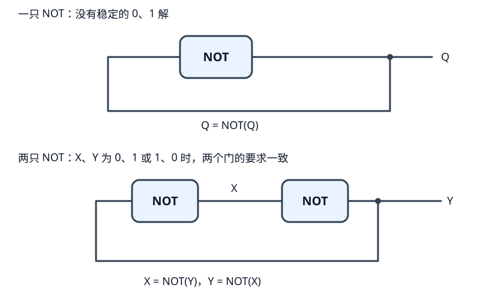
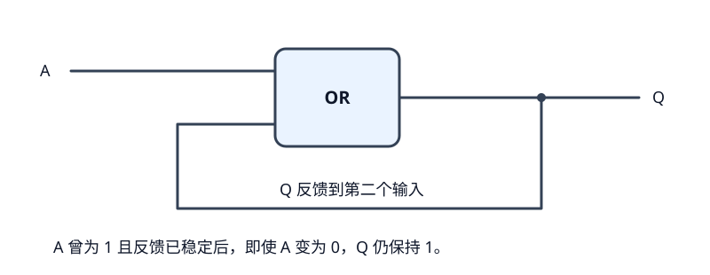
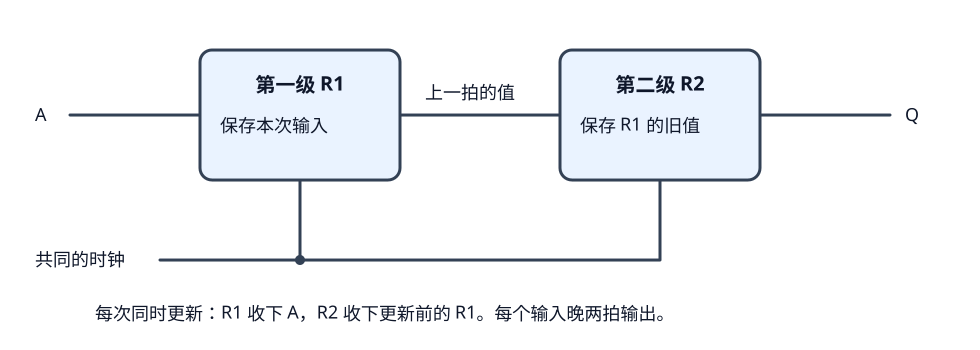
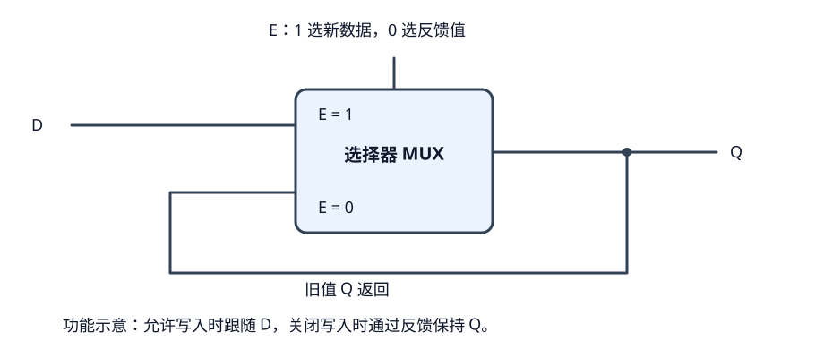
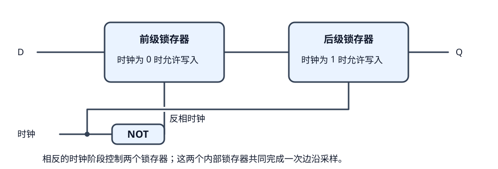
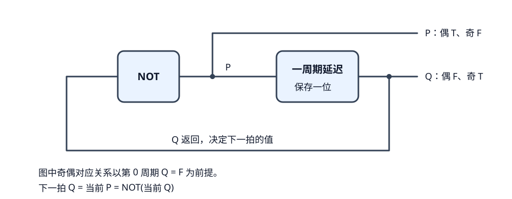
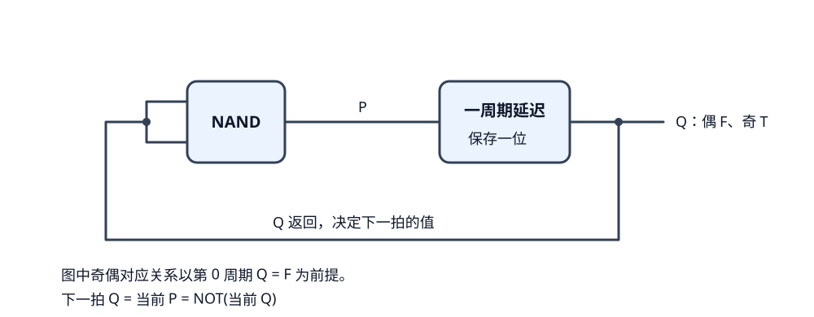
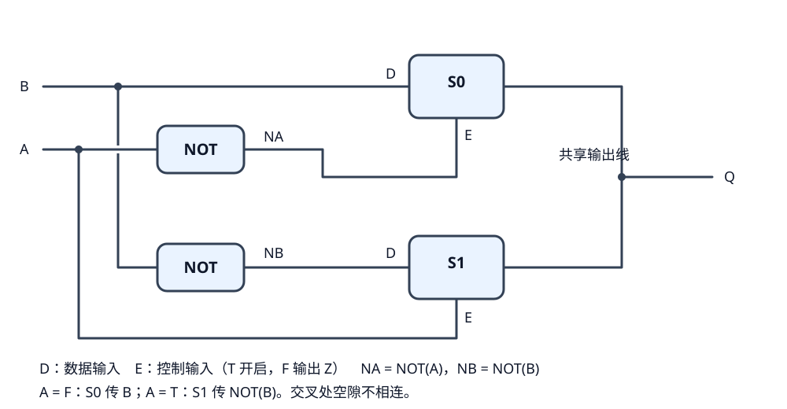

# 第六篇：反馈、时序与数据控制

前面的组合电路都是沿着输入、中间结果、输出的方向计算。这一篇从把输出接回输入开始，理解电路怎样保留状态。[第五篇](第五篇学习日志.md)继续记录单字节运算与数据控制，两篇随学习进度并行补充，不要求先完成其中一篇才继续另一篇。

运算和存储也会共用基础知识：逻辑门既能计算结果，也能参与构成反馈；选择器既能选运算数据，也能帮助选择写入新值还是保留旧值。这些联系在用到时互相引用，不按章节把它们完全隔开。

本篇沿着两条线展开：先通过反馈、延迟和周期翻转理解怎样保留、更新状态，再通过二进制开关理解怎样控制数据。后续的可控反相器和数据选择器接在后一条线上；它们本身属于组合逻辑，不会因为能控制数据就自动具备存储能力。译码与存储位置的选择另篇整理。

需要复习按位计算时，可以回看第五篇的[单字节 NOT](第五篇学习日志.md#1-单字节非门把八个位分别取反)和[单字节 NAND](第五篇学习日志.md#2-单字节与非门两个字节的对应位分别做-nand)。这里继续研究它们算出的值怎样保留到以后使用。

## 1. 循环依赖：现实电路允许输出接回输入吗？

允许。把输出接回前面的输入，叫作**反馈**。电路的某个结果通过导线返回，又影响后面的结果，于是形成一个环。

题目限制某些关卡不允许循环依赖，是这些题目的搭建约束，不能据此推断现实电路也禁止反馈。实际设计中，反馈能用于保存状态；但接成一个环，并不自动意味着电路就能正常工作。

### 为什么看起来像“必须先知道答案，才能算出答案”？

之前算一个门时，可以先确定输入，再算输出。输入又来自自己的输出后，这种从头到尾只算一遍的方法就不够了。

不过，真实的门没有在执行“先调用自己、等自己返回”的程序。导线上存在实际电压，门根据输入电压作出响应，变化又需要经过传播延迟才能沿反馈路径传回来。因此，需要一起考虑电路原来的状态，以及它随后怎样随时间变化。

这里的“经过一段时间”不等于“自动等到下一个时钟周期”。裸反馈环不一定有时钟，也不能仅凭门的延迟就把它当作一个可靠的寄存器。

### 先看有没有稳定的 0、1 组合

“稳定”在这里可以先理解为：给每根线指定 0 或 1 后，所有门都认可当前输入与输出，不再要求某根线改变。



#### 一只 NOT 接回自己：找不到稳定的二值解

把同一根反馈线叫 Q。要稳定，就必须满足：

```text
Q = NOT(Q)
```

尝试两个可能的逻辑值：

| 假设 Q 是什么 | NOT 要求输出什么 | 与假设一致吗？ |
| --- | --- | --- |
| 0 | 1 | 不一致 |
| 1 | 0 | 不一致 |

所以只用稳定的 0、1 来描述，找不到答案。不能把它当作一个会稳定保存 0 或 1 的电路。

这也不能直接推出“现实中一定按固定速度在 0、1 之间翻转”。真实电路还涉及中间电压、器件特性和延迟，具体连接可能出现振荡，也可能落在不适合当作有效 0、1 的电压附近；只看这张真值表无法确定具体波形。

#### 两只 NOT 首尾相接：有两种稳定逻辑状态

把中间两根线叫 X、Y：

```text
X = NOT(Y)
Y = NOT(X)
```

试着给出一组值，再检查两个门是否都同意：

| X | Y | 第一只门：NOT(Y) 是否等于 X | 第二只门：NOT(X) 是否等于 Y |
| --- | --- | --- | --- |
| 0 | 1 | 是，NOT(1) = 0 | 是，NOT(0) = 1 |
| 1 | 0 | 是，NOT(0) = 1 | 是，NOT(1) = 0 |

例如 X 已经为 0、Y 已经为 1：Y 的 1 让第一只 NOT 继续输出 X = 0，X 的 0 又让第二只 NOT 继续输出 Y = 1。两个门的要求彼此一致，就可以维持这种状态。

反过来的 X = 1、Y = 0 也一样。这里就出现了两种可以代表一位信息的状态：用 X = 0 表示记住 0，用 X = 1 表示记住 1。

这种“用反馈维持两种稳定状态”的思路，是构造存储电路的基础。[MIT 的时序逻辑讲义](https://computationstructures.org/notes/sequential_logic/notes.html)从两只反相器构成的反馈环开始，进一步解释如何加入控制来保存数据。实际硬件还需要处理初始化和时序等问题；两行逻辑检查并不能代替完整的电路设计。

### 能维持状态，还不等于已经有了好用的存储器

只有这两只 NOT，还没有说明怎样主动写入想要的 0 或 1，也不能保证上电后一定从哪种状态开始。继续搭存储电路时，需要解决这些具体任务：

- **写入：** 用输入和控制电路，把状态改成要保存的值。
- **保持：** 不要求写入时，让反馈维持已有状态。
- **初始化：** 需要确定起点时，通过复位或明确的写入建立初始值。

这些会在实际搭锁存器、触发器等部件时展开。当前先理解：**反馈使得电路可能保留过去的状态；反馈的结构和控制方式，决定它能否可靠地保存数据。**

### 和前面的组合逻辑有什么区别？

| 电路 | 判断结果时要考虑什么 |
| --- | --- |
| 前面的 AND、加法器、按位 NAND 等组合电路 | 当前输入；等待传播完成后得到结果 |
| 具有存储能力的电路 | 当前输入，以及已经保存的状态；还要遵守写入时刻等约定 |

因此，遇到反馈之后，单列一张“外部输入是什么，输出就是什么”的表可能不够。还要描述之前处于什么状态、什么时候允许改变，以及改变后留下什么状态。

这一节先讨论反馈的含义与可能行为。具体关卡要求保持、翻转还是产生某种输出，需要根据它的目标另行设计，不能仅凭“本次允许循环依赖”就确定接法。

## 2. 一个反馈例子：用 OR 把出现过的 1 留住

如果先要搭出一条有外部输入、也有反馈的电路，可以从一只 OR 开始。它的第一个输入接外部信号 A，输出叫 Q；把 Q 分成两路，一路接输出端，另一路接回 OR 的第二个输入。



这里接回去的是 OR 的一个输入端。不要把外部 A 和输出 Q 直接并在同一根线上：它们是两路不同的信号，由 OR 来判断。

### 为什么它能把 1 留住？

先看 A 为 1 的时候。OR 只要收到一个 1，输出就为 1，所以不管反馈线上原来是什么，Q 都会变成 1。等待这个 1 沿反馈线传回后，OR 的第二个输入也为 1。

此时再把 A 改成 0，OR 收到的是：

```text
第一个输入 A = 0
第二个输入是反馈回来的 Q = 1
OR(0, 1) = 1
```

Q 因此仍为 1，这个 1 又继续反馈回来。外部的 A 已经变回 0，Q 却保留了之前被置成 1 的状态。

这就是反馈与前面普通接线的区别：以前输入变成 0 后，只看当前输入就能判断输出；这里还要知道反馈环之前保持着什么值。

### 把原状态和外部输入一起列出来

下面的表是在理想逻辑模型下，假设原来的 Q 已经稳定，并给信号足够的传播时间：

| 原来稳定的 Q | 外部输入 A | 传播后稳定的 Q | 发生了什么 |
| --- | --- | --- | --- |
| 0 | 0 | 0 | OR(0, 0) = 0，保持原来的 0 |
| 0 | 1 | 1 | OR(1, 0) = 1，变成 1 后由反馈维持 |
| 1 | 0 | 1 | OR(0, 1) = 1，保持原来的 1 |
| 1 | 1 | 1 | OR(1, 1) = 1，仍然为 1 |

表中“原来”和“传播后”描述的是一次输入变化前后的状态，不是两个时钟周期。这张电路没有接时钟。

### 这个例子有什么限制？

它只能通过 A 把 Q 置成 1，不能再通过 A 把已经为 1 的 Q 清成 0：A 为 0 时会保留这个 1，A 为 1 时也仍然输出 1。

另外，不能仅凭图就假设它上电后必定从 Q = 0 开始。模拟器怎样给环路设置初值，是模拟器的规则；实际硬件若要求确定的初始状态，就要设计初始化方式。用 A = 1 可以让这个例子进入确定的 Q = 1，但不能让它进入确定的 Q = 0。

因此，它适合说明“输出反馈回来，怎样维持已有状态”。要做能主动写入 0、写入 1、保持数据的存储部件，还需要增加相应的控制。

这个接法确实形成了反馈环，但具体关卡是否接受，还要看它是否有额外的元件限制、初始化约定或输出要求；这里尚未作关卡通过的结论。

## 3. 晚点到站：把输入延迟两个周期

这一题要求输出跟随输入，但晚两个周期。输入每周期可以变化，所以需要依次保留每一拍的值，到了对应时刻再输出。

可用的元件中有“一周期延迟”，同一种元件可以放两只。因此具体接法就是：

```text
输入 → 第一只一周期延迟 → 第二只一周期延迟 → 输出
```

例如输入依次为 `1、0、1、1`，那么输出在两个周期后也要依次出现 `1、0、1、1`。要求保留的是整段输入序列，并不只是等两拍后亮一下。

### 从“下一拍再交出去”开始

先假设有一个能够保存一位、每个周期更新一次的部件：它在本次更新时收下输入，在接下来的周期里保持这个值。这样就能把一拍的数据留给下一拍使用。

要晚两个周期，可以串联两级这样的部件：



图是功能示意：第一级保存的值叫 R1，第二级保存的值叫 R2，Q 直接取 R2。在本题中，用两只一周期延迟元件对应这两级即可。图中的共同更新时钟，是用于解释同步硬件的工作方式，不代表还需要为游戏元件增加一个未提供的时钟引脚。

### 每一拍，两级分别收下什么？

在同一个更新时刻：

```text
R1 的新值 = 本次采样的输入 A
R2 的新值 = 更新前的 R1
输出 Q    = R2
```

关键是第二条：**R2 收下的是 R1 更新前的旧值。** 两级同时更新，不是先改 R1，再让 R2 立即拿走刚改出的新值。否则同一个输入会一次穿过两级，就没有得到想要的两次逐拍传递。

可以把它想成两个相邻的格子：每次推进时，原来第一格里的值移到第二格，新输入进入第一格。两格都被新输入覆盖，就不叫逐格移动了。

### 用一段输入逐拍核对

为把计数说清楚，下面从第 0 周期开始：A 是本周期提供、在周期结束时被采样的值；表中的 R1、R2 是本周期内已经保存的值。到下一周期时，按上面的规则同时更新两级。

另外，先假设两级初始值都为 0，这只是本表的起始条件：

| 当前周期 | 本周期输入 A | R1 当前保存的值 | R2，也就是输出 Q |
| --- | --- | --- | --- |
| 0 | 1 | 0 | 0 |
| 1 | 0 | 1 | 0 |
| 2 | 1 | 0 | 1 |
| 3 | 1 | 1 | 0 |
| 4 | 0 | 1 | 1 |
| 5 | 0 | 0 | 1 |

只追踪第 0 周期输入的那个 1：

1. 第 0 周期，它还在输入端 A，输出仍是初始值。
2. 第 1 周期，它已存入 R1，R2 保存的是更早的值。
3. 第 2 周期，它从 R1 进入 R2，才出现在输出 Q。

第 1 周期输入的 0，则在第 3 周期输出。第 2、3 周期输入的两个 1，分别在第 4、5 周期输出。每个值都按原顺序晚两拍出现。

用 A[n] 表示第 n 周期的输入，Q[n] 表示第 n 周期的输出，就可以简写为：

```text
Q[n + 2] = A[n]
```

### 最开始两拍输出什么？

最开始还没有“两拍之前”的输入可以取，输出来自部件的初始状态。上面的表设初值为 0，因此前两拍输出 0；实际实现若没有给定初值，就不能自行认定为 0。需要按元件的初始化或复位规则，以及题目的起始输出要求处理。

### 为什么不能直接串联两只 NOT？

两只 NOT 会把值翻转两次，最终恢复原值。它们产生的是[门的传播延迟](../01-布尔代数/从与非门开始搭逻辑门.md#10-输入变化后输出为什么会晚一点)，不能仅凭“两只门”就断定输入被保存了两个时钟周期。

一周期延迟部件的任务，是每拍收下一个值并保留它；普通逻辑门的任务，是响应输入变化。要保证无论这两拍中出现什么其他输入，旧值都能按时输出，就需要保存并逐拍传递这些值。

这种把数据逐级传递的结构，是移位寄存器的基本思路。这里移动的是数据到达输出的时间；[前一篇的字节翻倍](第四篇学习日志.md#6-超级加倍把一个字节的输入翻倍)移动的是各个位在同一字节中的位置，两者需要分清。

这套串联接法按每只元件延迟一个周期的规则成立；最开始两拍仍要按元件的初始状态处理。这里核对了逻辑和输入序列，尚未记录实际关卡的运行结果。

### 一周期延迟元件里面，可能有什么？

从真实数字硬件的角度看，它需要完成两件事：**保存一个值，以及按约定时刻更新这个值。** 一位数据可以用 D 触发器保存；一个字节则可以用八个一位触发器，共用时钟，分别保存八个位，组成一个八位寄存器。

这不是对游戏内部代码或元件实现的判断，而是用一种常见的硬件思路解释这种功能。

#### 第一步：反馈负责把旧值留下

前面的 OR 反馈能保留已经出现的 1，但不能主动写回 0。想保存任意输入，就要能在两种来源之间选择：

- 需要写入时，选择外部的新数据 D。
- 需要保持时，选择反馈回来的旧值 Q。

完成这种“二选一”的电路叫选择器，也常写成 MUX。可以先把它理解成一个由控制信号决定接哪一路的开关。

把选择器的输出接回其中一个数据输入，就得到下面的保存思路：



E 是写入允许信号。按图中的规则：

| E | 选择哪一路 | Q 的行为 |
| --- | --- | --- |
| 1 | 外部数据 D | 经过传播延迟后跟随 D，可以写入 0 或 1 |
| 0 | 反馈回来的 Q | 保持此前留下的值 |

例如，先令 E = 1、D = 1，等 Q 稳定为 1，再把 E 变成 0。选择器改选反馈的 1，于是外面的 D 即使变成 0，Q 仍能保持 1。要改存 0，就让 D = 0，再允许写入，等结果稳定后关闭写入。

这种“允许时跟随输入，关闭时保持”的部件叫**锁存器**。图中用选择器概括其功能；可靠实现还需要合适的反馈结构和控制时序，不能认为任意选择器随手接回去都会可靠存储。这个构造思路可参考 [MIT 关于反馈和 D 锁存器的说明](https://computationstructures.org/notes/sequential_logic/notes.html)。

#### 第二步：让更新只发生在一个约定的时刻

锁存器在 E = 1 的整段时间里都会跟随输入。要实现按时钟边沿采样的部件，可以把两个锁存器串起来，让它们在相反的时钟阶段允许写入。这是构造 D 触发器的一种常见思路：



以“时钟从 0 变成 1 时采样”为例，按理想工作过程看：

1. **时钟为 0：** 前级允许输入 D 进入；后级关闭，所以最终输出 Q 保持不变。
2. **时钟从 0 变成 1：** 前级关闭，把这一刻采到的值留住；后级打开，让前级保存的值传到 Q。
3. **时钟保持为 1：** 前级已经关闭，外部 D 后续怎么变化，都进不了前级，所以不会一路穿到输出。
4. **时钟回到 0：** 后级关闭并保持 Q，前级重新接收输入，为下一次上升沿作准备。

这样，从外面看，Q 只会在上升沿采样后，经过器件的传播延迟更新；其他时间保持不变。这类部件叫**边沿触发的 D 触发器**，D 是数据输入，Q 是保存后的输出。

图中是便于理解的分级结构。真实电路还要控制内部延迟，避免前后两级在切换时同时透传，不能只靠在时钟线上加一个普通 NOT 就认定得到了可靠的触发器。

两个内部锁存器共同构成的是一个触发器，并不等于“两周期延迟”。这里靠相反的时钟阶段形成一次采样；前面两周期延迟图中的 R1、R2，才是两级在同一边沿更新的保存部件。

#### 第三步：把触发器按周期组织起来

每个采样边沿，第一级收下本次 D，并保持到下一个更新时刻。将它的输出交给下一级触发器，下一级在同一边沿收下的是前一级原来的值，于是数据每次前进一级。

因此，“延迟一周期”是在规定采样和更新规则下描述序列的关系。它不是说输入随便在什么时刻变化，输出都恰好在一整段周期之后变化。例如一个上升沿触发的部件，边沿过后才到来的新输入，要等下一个上升沿才会被采样。

真实触发器还要求输入在采样边沿前后的一小段时间保持稳定：前面的要求叫建立时间，后面的要求叫保持时间。当前先知道要按时钟规则交接数据即可，具体时间值取决于所用器件。

从这一层看，一周期延迟并不是让一根导线故意传得很慢，而是用存储部件留住采到的值，再在规定的更新时刻交接出去。

## 4. 奇变偶不变：每过一周期就翻转一次

要求偶数周期输出 F，奇数周期输出 T。我的接法是：NOT 的输出接一周期延迟元件的输入，延迟元件的输出分成两路，一路作为最终输出，另一路接回 NOT 的输入。

### 从“下一拍应该怎样”推导

先不管具体接线，只看目标的变化规律：

- 这一拍为 F，下一拍就该为 T。
- 这一拍为 T，下一拍就该为 F。

所以需要记住当前值，再让下一拍变成它的相反值。延迟元件负责把一个值保存到下一拍，NOT 负责取反。

把延迟元件当前的输出叫 Q，NOT 的输出叫 P：

```text
P = NOT(Q)           算出下一拍需要的值
下一周期的 Q = P     由一周期延迟元件送出
```

合起来就是：**下一拍的 Q，等于这一拍 Q 的相反值。**



图里的 P、Q 是同一个环上两个不同位置的信号。NOT 算出 P 后，Q 不会立刻跟着改变，要等延迟元件推进一个周期。否则就退回前面的裸 NOT 反馈，无法用这个逐拍规则分析。

### 把初始值和周期编号说清楚

下面把初始时刻记作第 0 周期，第一次推进后记作第 1 周期，并假设延迟元件初始输出 Q = F：

| 周期 n | 当前 Q：延迟元件的输出 | 当前 P = NOT(Q) | 下一周期的 Q |
| --- | --- | --- | --- |
| 0 | F | T | T |
| 1 | T | F | F |
| 2 | F | T | T |
| 3 | T | F | F |
| 4 | F | T | T |
| 5 | T | F | F |

第 0 周期，Q 为 F，NOT 算出 T 并交给延迟元件；第 1 周期，Q 才变成 T，这时 NOT 又算出 F，等到第 2 周期才由 Q 输出。于是 Q 一直按 F、T、F、T……交替。

**在这个起始约定下，从 Q 取输出，就得到偶数周期 F、奇数周期 T。** 如果元件初始输出为 T，或者把初始状态称为第 1 周期，奇偶对应关系就会交换。交替翻转是接线决定的，从哪一种值开始则要看初始状态和编号约定。

### 如果要求偶数周期 T、奇数周期 F 呢？

直接从图中的 P 取输出即可。P 本来就是 NOT(Q)，所以每一拍都与 Q 相反：

```text
周期：0  1  2  3  4  5
Q：   F  T  F  T  F  T
P：   T  F  T  F  T  F
```

具体操作是：保留 NOT → 延迟元件 → NOT 的整个环，将最终输出端改接到 NOT 的输出线上。这根线上原本还接着延迟元件的输入，现在分一路给最终输出就行，不需要增加一只 NOT。

反馈仍然要从延迟元件的输出 Q 接回原来的 NOT。只改最终输出端取信号的位置，不要把延迟元件绕过去。

如果元件支持指定初始状态，也可以把初始 Q 设成 T，继续从 Q 输出；这要以元件确实提供初始化功能为前提，不能通过普通连线就默认做到了。

### 另一种接法：用 NAND 代替 NOT

前面已经有 `NAND(Q, Q) = NOT(Q)`。因此可以把 Q 同时接到一只 NAND 的两个输入端，用 NAND 的输出接延迟元件：



| 当前 Q | NAND 收到的两个输入 | NAND 输出，也就是下一拍 Q |
| --- | --- | --- |
| F | F、F | T |
| T | T、T | F |

这与 NOT 的接法具有相同的逐拍规则，同样需要一只逻辑门和一只一周期延迟元件。它提供的是另一种取反实现，元件数没有减少。初始值相同时，两种接法产生的 Q 序列也相同。

### 这一关开始在“数周期”了

之前的奇数计数判断的是当前几路输入中有几个 T；这里判断的则是推进次数的奇偶。电路不需要保存完整的周期编号，只要保存一位：每推进一次就翻转，便能区分奇、偶两种状态。

这可以看作最简单的一位二进制计数器：反复在 0、1 之间切换。Q 每两拍回到相同的值，完整重复一次需要两个输入周期。以后用多位保存更大的计数值，会继续用到“当前状态决定下一状态”的方法。

按两个可能的初始值分别推演，NOT 与 NAND 两种结构都每拍翻转一次，P、Q 始终互反。具体哪一路符合关卡的奇偶要求，需要对照其首拍编号和初始输出；上面的表已经明确列出所用约定。

## 5. 二进制开关：用两个 NOT 和两个开关搭出 XOR

这一节继续放在反馈与存储这条学习线上，因为开关能帮助选择由谁提供数据，和前面锁存器的“选新数据还是反馈值”相联系。不过，这道 XOR 电路自身没有反馈，也不保存状态，仍然属于组合逻辑。

### 开关关闭，不等于输出 F

这次的开关有三个引脚：左边接数据 D，下方接控制 E，右边是输出。按题目给出的规则，下方为 F 时禁止输出，为 T 时输出左边的数据。

| 控制 E | 数据 D | 开关输出 |
| --- | --- | --- |
| F | F | Z |
| F | T | Z |
| T | F | F |
| T | T | T |

Z 表示高阻态，可以先理解为输出端与这条线断开。它既不主动送出 T，也不主动送出 F。

因此，E = T 并不代表开关一定输出 T，只代表它允许数据通过：左边是 F，它就输出 F；左边是 T，它才输出 T。E = F 则是停止提供数据，输出为 Z。

这里与 AND 有一个关键差别：AND 的控制输入为 F 时仍会输出 F，而开关关闭时输出的是 Z。正是这个“退出连接”的能力，让多个开关能够轮流使用同一条输出线。

### 为什么这次可以把两路输出接在一起？

用题目给出的输出合并规则整理成表：

| 第一路输出 | 第二路输出 | 合并后的线 |
| --- | --- | --- |
| F | F | F |
| F | T | 冲突 |
| F | Z | F |
| T | F | 冲突 |
| T | T | T |
| T | Z | T |
| Z | F | F |
| Z | T | T |
| Z | Z | Z |

最需要用到的是 F 与 Z 合成 F、T 与 Z 合成 T：一边提供有效值，另一边退出，由提供值的一边决定线路状态。

如果一边强行给 F，另一边强行给 T，就产生冲突。两边都是 Z 时也没有得到一个有效的 T 或 F。要让输出始终明确，这道题应当让两个开关**恰好有一个开启**。

这里的 Z 是输出端不驱动线路的状态，不是新的二进制数字，也不能当作存储了一个值。真实硬件中对应的部件常叫三态缓冲器；例如 [TI 的 SN74AUC1G126](https://www.ti.com/product/SN74AUC1G126) 就提供可禁用的高阻输出。

### 从 XOR 的要求倒推怎样选路

XOR 要求 A、B 不同时输出 T。先只固定 A，不急着想怎么接线：

- **如果 A 已经是 F：** 要一真一假，B 就必须是 T。所以 B 为 F 时输出 F，B 为 T 时输出 T，输出直接跟随 B。
- **如果 A 已经是 T：** 要一真一假，B 就必须是 F。所以 B 为 F 时输出 T，B 为 T 时输出 F，输出正好与 B 相反。

把这两句话整理成表：

| A 固定为什么 | B = F 时应输出 | B = T 时应输出 | 可以直接选择哪路数据 |
| --- | --- | --- | --- |
| F | F | T | B |
| T | T | F | NOT(B) |

所以问题可以改写成：**A 为 F 时选 B，A 为 T 时选 NOT(B)。**

这样两个 NOT 的用途就确定了：一只得到 NOT(B)，作为其中一路数据；另一只得到 NOT(A)，和 A 一起让两个开关轮流开启。

### 两个开关具体怎么接？

| 元件 | 数据输入（左侧） | 控制输入（下方） | 何时输出数据 |
| --- | --- | --- | --- |
| 开关 S0 | B | NOT(A) | A = F 时 |
| 开关 S1 | NOT(B) | A | A = T 时 |

最后把 S0、S1 的输出接到同一条输出线 Q。



图中的 D 是数据端，E 是控制端。两个 NOT 的输出分别标为 NA、NB，即 NOT(A)、NOT(B)。只有两个开关的输出在右侧圆点处合并；A、B 和 NOT 的输出不能随意并到这根线上。

这个接法恰好使用两个 NOT、两个开关。NOT(A) 和 A 的逻辑值相反，因此在输入稳定后，S0 和 S1 中恰好只有一只开启。

### 沿着已经接好的线，怎样读懂它？

先分清开关的两种输入：**左侧决定“传什么”，下方决定“让不让传”。** 读图时先看控制线，确定哪只开关开启，再沿它的数据线找出输出，不必同时追踪所有支路。

**当 A = F：**

1. 上方 S0 的控制端收到 NOT(A) = T，所以 S0 开启。
2. 下方 S1 的控制端收到 A = F，所以 S1 关闭，输出 Z。
3. S0 的数据端接的是 B，因此最终 Q = B。此时只需要继续看 B 的值。

**当 A = T：**

1. 上方 S0 的控制端收到 NOT(A) = F，所以 S0 关闭，输出 Z。
2. 下方 S1 的控制端收到 A = T，所以 S1 开启。
3. S1 的数据端接的是 NOT(B)，因此最终 Q = NOT(B)。

这样就把一张有多根交叉线的电路，读成了“用 A 选择 B 或 NOT(B)”。两只 NOT 的用途也分开了：一只把选择条件 A 取反，让两个开关轮流开启；另一只把数据 B 取反，提供需要的另一种输出。

元件放在哪里、导线绕了几道弯，不会改变这些连接关系。判断两张图是不是同一种接法，要逐个比较数据端、控制端和输出端接到什么信号。

### 把四种情况连同 Z 一起算出来

| A | B | NOT(A) | NOT(B) | S0 输出 | S1 输出 | 最终 Q |
| --- | --- | --- | --- | --- | --- | --- |
| F | F | T | T | F | Z | F |
| F | T | T | F | T | Z | T |
| T | F | F | T | Z | T | T |
| T | T | F | F | Z | F | F |

例如 A = T、B = F：

1. NOT(A) = F，上方 S0 关闭，输出 Z。
2. A = T，下方 S1 开启。
3. S1 的数据来自 NOT(B)，此时是 T，所以它输出 T。
4. 输出线上合并的是 Z 与 T，结果是 T。

再看 A、B 都为 T：上方仍然关闭，但下方的数据 NOT(B) 变成 F，所以 Q 为 F。最终四行是 F、T、T、F，正好是 XOR。

这里的共线连接并没有自动执行 OR。输出值来自当时开启的那只开关；关闭的另一只必须退出，而不是送来一个 F。

### 下次怎样从零想到这种接法？

这次可以留下一个具体的方法：

1. 先固定一路输入，例如 A = F，把目标真值表中符合它的行单独拿出来，看输出与 B 有什么关系。
2. 再固定 A = T，找出另一种关系。
3. 分别准备这两路数据。本题得到的是 B 和 NOT(B)。
4. 用 A、NOT(A) 控制两只开关，选择当前应该输出的那一路。
5. 最后逐行检查：值是否正确、是否恰好只有一只开关开启、有没有冲突或两边都退出的情况。

核心是先把问题拆成“在这个条件下该输出什么”，再用开关选择对应结果。这样，列完真值表之后，就有了继续推到接线的方法。

### 它和存储有什么联系？

这道题做的是二选一：根据 A，选择 B 或 NOT(B)。这种选择数据的功能就是前面讲的选择器。可以回看[选择新值或反馈值的锁存器思路](#一周期延迟元件里面可能有什么)，那里需要选择的两路变成了外部新数据和已经保存的值。

开关负责决定谁能把数据送上线路；保存状态则还需要反馈或存储部件。共享数据通路时，多路来源也可以通过这种方式轮流提供数据。

上述真值表验证的是稳定输入下的逻辑。实际三态线路切换时，还要考虑启用与禁用的延迟，避免两路短暂同时驱动；不能仅因控制信号写成 A 和 NOT(A)，就把它当作已经完成时序验证的物理电路。题目中的输出合并表也不意味着普通硬件输出可以随意并联。
