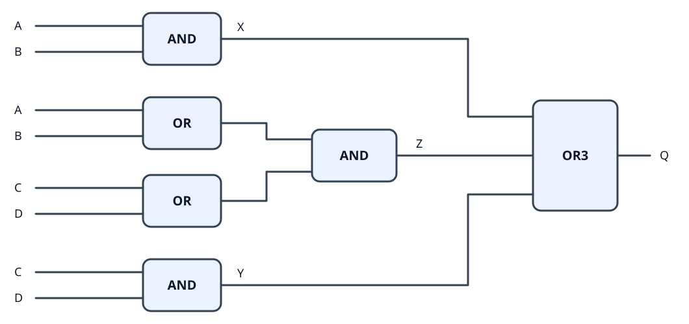
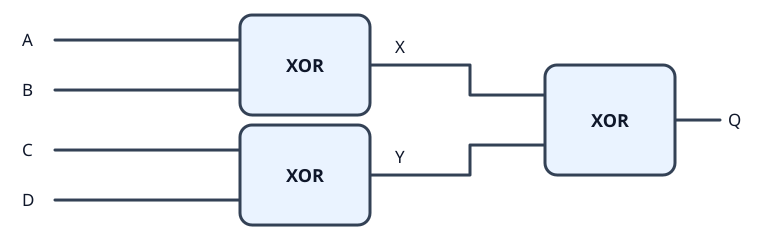
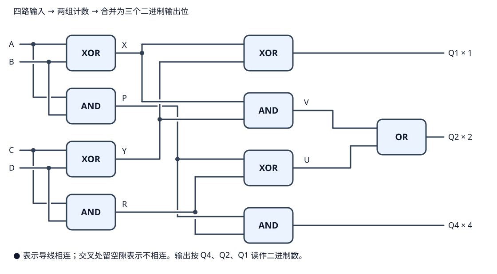
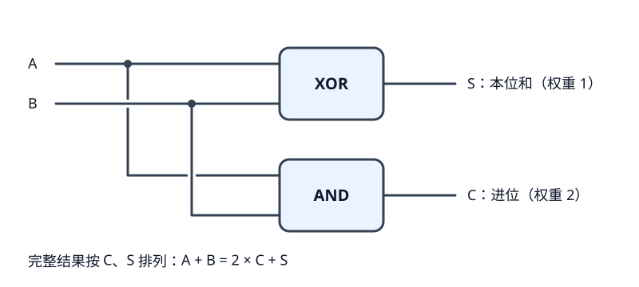
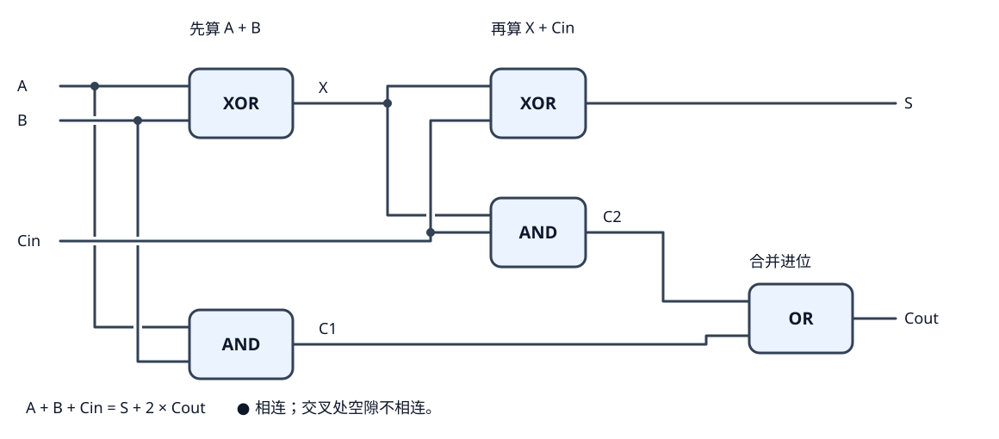
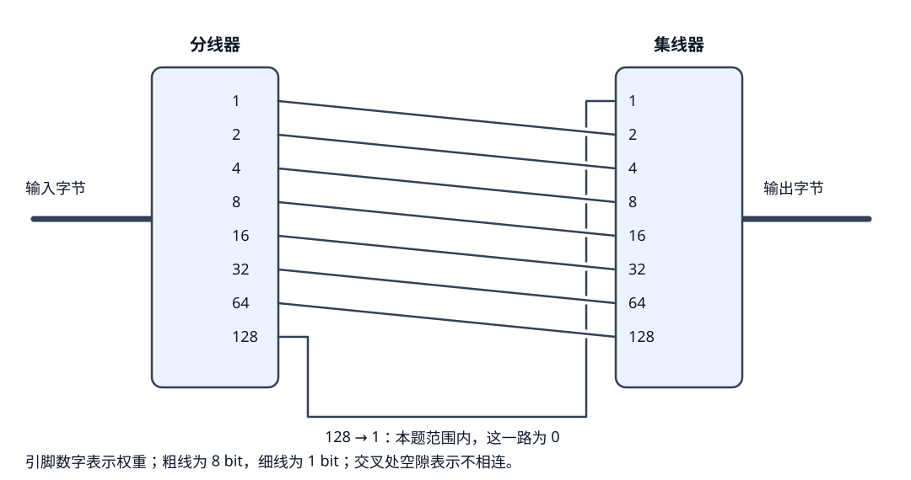

# 第四篇：从逻辑判断到二进制运算

## 1. 成双成对：四路输入中至少有两个为真

有四路输入 A、B、C、D。当其中有任意两个或两个以上为 T 时，输出 Q 为 T；只有零个或一个 T 时，输出为 F。

这里的“任意两个”包括 A、B，也包括 A、C、B、D 等组合。三个、四个输入为 T 时，同样要输出 T。

### 先把条件拆开

可以把四路输入分成两组：A、B 一组，C、D 一组。要凑出至少两个 T，只可能有下面几种情况：

| 情况 | 用什么来判断 |
| --- | --- |
| A、B 这一组已经有两个 T | AND(A, B) |
| C、D 这一组已经有两个 T | AND(C, D) |
| 两组各至少有一个 T | 先分别用 OR 检查每组，再用 AND 要求两组都满足 |

例如，A、C 为 T，B、D 为 F：虽然每组内部都凑不出两个 T，但两组各有一个，加起来就够两个了。第三条判断就是用来接住这种情况的。

反过来，如果三条都不成立，就表示每组都没有两个 T，并且两组也没有各占一个 T。这样总共最多只有一个 T，正好应该输出 F。

### 把三个判断接成电路

把三条判断的结果分别叫 X、Y、Z：

```text
X = AND(A, B)
Y = AND(C, D)
Z = AND(OR(A, B), OR(C, D))

Q = OR3(X, Y, Z)
```

最后用三路 OR，是因为这三个条件满足任意一个就够了。



图中重复出现的 A、B、C、D 都是原来的同四路输入，分别接到需要它们的门上。OR3 就是前面搭过的三路或门：三个输入中至少一个为 T，输出就为 T。

中间这条 Z 可以分两步读：

1. OR(A, B) 判断第一组有没有 T；OR(C, D) 判断第二组有没有 T。
2. AND 要求这两次判断都为 T，也就是每组都至少有一个 T。

所以最后的 AND 接收的是“每组有没有 T”这两个结果。它们同时为真，就能确认原来的四路输入中至少有两个 T。

### 三个或四个为真，也会算进去

这三个条件可以同时成立。例如四路都为 T，X、Y、Z 就都是 T，最后的 OR3 仍输出 T。

三个输入为 T 时，至少有一组的两个输入都为 T，X 或 Y 就会成立。因此，这条电路判断的是“至少两个”，也能接受三个和四个。

### 用完整真值表核对

四路输入一共有 16 种组合。表里的“T 的个数”只是帮助核对条件，电路实际按上面的三个判断工作。

| A | B | C | D | T 的个数 | Q |
| --- | --- | --- | --- | --- | --- |
| F | F | F | F | 0 | F |
| F | F | F | T | 1 | F |
| F | F | T | F | 1 | F |
| F | F | T | T | 2 | T |
| F | T | F | F | 1 | F |
| F | T | F | T | 2 | T |
| F | T | T | F | 2 | T |
| F | T | T | T | 3 | T |
| T | F | F | F | 1 | F |
| T | F | F | T | 2 | T |
| T | F | T | F | 2 | T |
| T | F | T | T | 3 | T |
| T | T | F | F | 2 | T |
| T | T | F | T | 3 | T |
| T | T | T | F | 3 | T |
| T | T | T | T | 4 | T |

按这条逻辑逐行计算，16 种输入都符合要求：零个、一个 T 时输出 F；两个、三个、四个 T 时输出 T。

这道题可以记下的思路是：先把总条件分成几种能看懂的小情况，再分别用门判断，最后把这些判断合起来。

## 2. 奇数计数：四路输入，用三个门判断

仍然有四路输入 A、B、C、D。这次要求：只有 T 的个数为奇数时，输出才为 T，而且最多使用三个元件。

四路输入中，T 的个数只能是 0、1、2、3、4。所以目标就是：**一个或三个 T 时输出 T，其他时候输出 F。**

### 从哪里想到 XOR？

先缩小问题，只看两路输入。XOR 在两路不同时输出 T，也就是恰好有一个 T 时输出 T；零个或两个 T 时都输出 F。

换句话说，**一个 XOR 已经能判断两路输入中 T 的个数是不是奇数。**

那就先把四路拆成两组：

- X = XOR(A, B)：第一组有奇数个 T，X 就为 T。
- Y = XOR(C, D)：第二组有奇数个 T，Y 就为 T。

现在不用再关心每组具体有几个 T，只需要看两组的奇偶性：

| 第一组的个数 | 第二组的个数 | 合起来 | 应输出 |
| --- | --- | --- | --- |
| 偶数 | 偶数 | 偶数 | F |
| 偶数 | 奇数 | 奇数 | T |
| 奇数 | 偶数 | 奇数 | T |
| 奇数 | 奇数 | 偶数 | F |

只有两组的奇偶性不同时，总数才是奇数。这恰好又是一个 XOR 的判断规则，所以把 X、Y 再送进一个 XOR 就行。

### 最后的电路

```text
X = XOR(A, B)
Y = XOR(C, D)
Q = XOR(X, Y)
```



总共三个 XOR，符合元件数量限制。前两个门可以同时计算，结果再经过最后一个门，从任意输入到输出都经过两级门。

拿三个 T 的情况试一下：A、B、C 为 T，D 为 F。

1. 第一组有两个 T，XOR(T, T) = F，表示这一组是偶数个。
2. 第二组有一个 T，XOR(T, F) = T，表示这一组是奇数个。
3. 最后 XOR(F, T) = T，说明总数是奇数。

这里 X 为 F，并不表示第一组没有 T。它只表示第一组的 T 个数是偶数，零个和两个都会得到 F。虽然具体数量丢掉了，但判断总数的奇偶性，只保留这些信息就够了。

### 用完整真值表核对

| A | B | C | D | T 的个数 | X | Y | Q |
| --- | --- | --- | --- | --- | --- | --- | --- |
| F | F | F | F | 0 | F | F | F |
| F | F | F | T | 1 | F | T | T |
| F | F | T | F | 1 | F | T | T |
| F | F | T | T | 2 | F | F | F |
| F | T | F | F | 1 | T | F | T |
| F | T | F | T | 2 | T | T | F |
| F | T | T | F | 2 | T | T | F |
| F | T | T | T | 3 | T | F | T |
| T | F | F | F | 1 | T | F | T |
| T | F | F | T | 2 | T | T | F |
| T | F | T | F | 2 | T | T | F |
| T | F | T | T | 3 | T | F | T |
| T | T | F | F | 2 | F | F | F |
| T | T | F | T | 3 | F | T | T |
| T | T | T | F | 3 | F | T | T |
| T | T | T | T | 4 | F | F | F |

逐行计算，16 种组合都符合要求。这个电路输出的是“个数是不是奇数”这一位信息，没有输出具体的个数。

### 这两道题在 CPU 里有什么用？

最直接的联系是二进制加法。计算多位数相加时，每一位可能要加三个东西：这一位的 A、这一位的 B，以及低一位传来的进位。负责处理这三个输入的电路叫作**全加器**。

把 T 当作 1、F 当作 0，三个输入相加的结果只取决于其中有几个 1：

| 三个输入中 1 的个数 | 相加的结果（二进制） | 向高一位进位 | 留在本位的结果 |
| --- | --- | --- | --- |
| 0 | 00 | 0 | 0 |
| 1 | 01 | 0 | 1 |
| 2 | 10 | 1 | 0 |
| 3 | 11 | 1 | 1 |

看最后两列，就能认出刚才做过的两种判断：

- **本位结果：有奇数个 1 时为 1。** 这就是奇数计数的规则，只是全加器这里有三个输入。
- **进位：至少有两个 1 时为 1。** 这就是“成双成对”的判断方式，同样改成三个输入。

例如 1 + 1 + 1 = 11₂：共有三个 1，是奇数，所以本位为 1；同时已经达到“至少两个”，所以进位也为 1。

前一题有四个输入，不能直接当作这个三输入全加器的进位电路。不过，把第四路 D 固定为 F，剩下三路的“至少两个为真”就正好是全加器的进位条件。同样，奇数计数电路把 D 固定为 F，也就只判断另外三路的奇偶性。

因此，这些练习里的判断规则，确实可以成为加法器的一部分。后面搭加法器时，就会把“本位怎么算”和“什么时候进位”这两个判断放在一起。

### 奇偶判断还可以用来检查数据

假设传送的数据是 1011，其中有三个 1。可以额外带上一位 1，让五位里的 1 总数变成偶数。接收方再检查总数是否仍为偶数：如果传送过程中只有一位翻转，总数的奇偶性一定改变，就能发现异常。

这叫作奇偶校验。它只能检查一部分错误：两个位一起翻转可能漏检，也不能仅凭这个结果知道哪一位出了错。现实中有专门完成这种功能的器件，例如 [TI 的 CD74HC280](https://www.ti.com/product/CD74HC280)，就是九位奇偶校验生成与检查器。

CPU 本身也有具体例子：x86 的 PF（奇偶标志）对于会更新它的指令，反映运算结果最低八位中 1 的个数是否为偶数。偶数时 PF 为 1，奇数时为 0。它判断的是偶数，和这里的奇数判断相反，但用到的是同一类规律。见 [Intel 处理器手册中的 PF 定义](https://www.intel.com/content/dam/support/us/en/documents/processors/pentium4/sb/25366521.pdf)。

这不意味着每个 CPU 都有一个叫“成双成对”的独立模块，或者都使用这张图的具体接法。这些题是在练习把需求拆成逻辑判断，而这些判断本身也确实会用于算术运算、状态判断和数据校验。

## 3. 信号计数：把四路输入中的 T 个数输出为二进制

四路输入仍然是 A、B、C、D。这次要输出具体有几个 T。三个输出引脚的权重分别是 1、2、4，记作 Q1、Q2、Q4。

每个引脚本身仍然只有 T、F 两种状态；把它们当作 1、0，计数结果就是：

```text
数量 = 1 × Q1 + 2 × Q2 + 4 × Q4
```

例如有三个 T，就让 Q1、Q2 为 T，Q4 为 F，表示 1 + 2 = 3。写成二进制时，高位放在左边，所以顺序是 **Q4、Q2、Q1**，也就是 `011`。接线时按引脚标出的权重连接，不要把书写顺序和引脚位置混在一起。

这里统计的是当前四路输入中有几个 T。输入保持不变，稳定后的结果也保持不变；它属于组合逻辑电路，不需要每过一个时钟周期就累加一次。

### 先看三个输出位分别要做什么

只按 T 的数量分组，就能得到目标：

| T 的个数 | 二进制结果 | Q4（权重 4） | Q2（权重 2） | Q1（权重 1） |
| --- | --- | --- | --- | --- |
| 0 | 000 | 0 | 0 | 0 |
| 1 | 001 | 0 | 0 | 1 |
| 2 | 010 | 0 | 1 | 0 |
| 3 | 011 | 0 | 1 | 1 |
| 4 | 100 | 1 | 0 | 0 |

从最后三列分别读条件：

- **Q1：一个或三个 T 时为 T。** 就是上一题的奇数计数。
- **Q4：四个输入全为 T 时才为 T。**
- **Q2：两个或三个 T 时为 T。** 四个 T 时，这一位反而必须回到 F。

因此，“成双成对”的输出不能直接当作 Q2：它在四个 T 时也会输出 T，但二进制的 4 是 `100`，其中权重 2 的那一位为 0。

### 先数两小组，再合起来

沿用前面的分组：A、B 一组，C、D 一组。每组最多两个 T，可以用两位表示组内的数量。

先看 A、B：

| A | B | 组内数量 | P = AND(A, B) | X = XOR(A, B) |
| --- | --- | --- | --- | --- |
| F | F | 0（00） | 0 | 0 |
| F | T | 1（01） | 0 | 1 |
| T | F | 1（01） | 0 | 1 |
| T | T | 2（10） | 1 | 0 |

X 表示这一组恰好有一个 T，P 表示这一组有两个 T。按 P、X 排起来，就得到了这组的二进制数量。

另一组同理，用 Y 表示恰好一个 T，R 表示两个 T：

```text
X = XOR(A, B)      P = AND(A, B)
Y = XOR(C, D)      R = AND(C, D)
```

X、Y、P、R 都只是给导线上的中间结果起的名字，不是额外的存储元件。

### 依次得到三个输出

**Q1：两组的奇偶性不同，总数就是奇数。**

直接沿用上一题：

```text
Q1 = XOR(X, Y)
```

**Q4：总共有四个 T，意味着每组都有两个 T。**

P、R 必须同时为 T：

```text
Q4 = AND(P, R)
```

**Q2：总数为二或三，可以拆成两种情况。**

1. 恰好有一组是两个 T，另一组只能是零个或一个，总数就是二或三。用 XOR(P, R) 判断。
2. 两组都恰好有一个 T，总数就是二。用 AND(X, Y) 判断。

这两种情况满足任意一种就行，所以最后用 OR：

```text
U = XOR(P, R)
V = AND(X, Y)
Q2 = OR(U, V)
```

为什么四个 T 不会混进来？此时 P、R 都为 T，所以 U 为 F；X、Y 都为 F，所以 V 也为 F。最后 Q2 为 F，正好把权重 2 的那一位清掉，只留下 Q4 为 T。

### 完整接线



图中画出了所有门之间的接线。圆点表示导线在这里相连；交叉处留有空隙表示只是经过，不相连。X、Y、P、R、U、V 标在相应导线上，可以对照上面的公式逐段查看。右侧 Q1、Q2、Q4 分别连接权重为 1、2、4 的输出引脚。

这套接法使用九个两输入门：四个 XOR、四个 AND、一个 OR。这里给出的是能逐步推导和核对的一种实现，不作最少元件数的结论。

以 A、B、C 为 T，D 为 F 为例：

1. 第一组有两个 T，得到 P = 1、X = 0。
2. 第二组有一个 T，得到 R = 0、Y = 1。
3. Q1 = XOR(0, 1) = 1。
4. U = XOR(1, 0) = 1，V = AND(0, 1) = 0，所以 Q2 = 1。
5. Q4 = AND(1, 0) = 0。

最终 Q4、Q2、Q1 是 `011`，表示三个 T。

### 核对全部输入

下表用 T、F 表示输入，用 1、0 表示输出位；它们是同一组逻辑值的两种写法。

| A | B | C | D | T 的个数 | Q4 | Q2 | Q1 |
| --- | --- | --- | --- | --- | --- | --- | --- |
| F | F | F | F | 0 | 0 | 0 | 0 |
| F | F | F | T | 1 | 0 | 0 | 1 |
| F | F | T | F | 1 | 0 | 0 | 1 |
| F | F | T | T | 2 | 0 | 1 | 0 |
| F | T | F | F | 1 | 0 | 0 | 1 |
| F | T | F | T | 2 | 0 | 1 | 0 |
| F | T | T | F | 2 | 0 | 1 | 0 |
| F | T | T | T | 3 | 0 | 1 | 1 |
| T | F | F | F | 1 | 0 | 0 | 1 |
| T | F | F | T | 2 | 0 | 1 | 0 |
| T | F | T | F | 2 | 0 | 1 | 0 |
| T | F | T | T | 3 | 0 | 1 | 1 |
| T | T | F | F | 2 | 0 | 1 | 0 |
| T | T | F | T | 3 | 0 | 1 | 1 |
| T | T | T | F | 3 | 0 | 1 | 1 |
| T | T | T | T | 4 | 1 | 0 | 0 |

按接线公式逐行计算，16 种输入的输出都与 T 的数量一致。

这道题的关键是：**有多个输出时，可以先把每一位单独看成一道判断题，再找能共用的中间结果。** 不必一开始就试图想出整张电路。

另外，组内“一个 XOR 输出本位，一个 AND 输出进位”的接法，正是半加器的结构。这里已经用它把两路 0、1 相加；下一步就可以顺着这个结构继续理解加法器。

## 4. 半加器：把两个二进制位相加

半加器有两路独立的一位输入 A、B，把 F 看作 0、T 看作 1，将它们相加。两路输出分别是：

- **本位和 Sum（S）**：留在当前这一位的结果，权重为 1。
- **进位 Carry（C）**：需要交给高一位的结果，权重为 2。

这里 S 和 C 都只是一位，各自只能输出 0 或 1。**S 只表示本位和；完整的加法结果，要把 C 和 S 一起看。** 两个输入相加的总值可以是 0、1、2。

### 从加法结果开始列真值表

两个一位输入只有四种组合，直接逐个相加：

| A | B | 加法 | 完整结果（二进制 CS） | 本位和 S | 进位 C |
| --- | --- | --- | --- | --- | --- |
| 0 | 0 | 0 + 0 = 0 | 00 | 0 | 0 |
| 0 | 1 | 0 + 1 = 1 | 01 | 1 | 0 |
| 1 | 0 | 1 + 0 = 1 | 01 | 1 | 0 |
| 1 | 1 | 1 + 1 = 2 | 10 | 0 | 1 |

最后一行是关键：二进制的一位只能放 0 或 1，放不下 2。于是把 2 写成二进制的 `10`，当前位留下 0，向高一位进一个 1。

这个进位 1 的权重是 2，所以并没有丢掉结果。始终有：

```text
A + B = S + 2 × C
```

这里的加号表示普通数值加法。

### 分别观察两个输出，就能找到需要的门

先只看 S 这一列：`0、1、1、0`。

它在 A、B 不同时为 1，相同时为 0，正好就是 XOR。因此：

```text
S = XOR(A, B)
```

再只看 C 这一列：`0、0、0、1`。

只有 A、B 都为 1 时，结果才达到 2，需要进位。这就是 AND 的条件。因此：

```text
C = AND(A, B)
```

这一步不需要猜门怎么组合：先把正确的加法结果列出来，再对每个输出列辨认它的逻辑规则，就得到了电路。

### 完整接线：两路输入同时送给两个门



A 分别接到 XOR 和 AND 的一个输入端，B 分别接到它们的另一个输入端。两个门各自接收同一组 A、B，并行算出 S 和 C。图中的圆点表示分支相连，交叉处的空隙表示不相连。

例如 A = 1、B = 1：

1. XOR(1, 1) = 0，所以 S 输出 F。
2. AND(1, 1) = 1，所以 C 输出 T。
3. 按高位在前的顺序读 C、S，得到 `10₂`，也就是十进制的 2。

按这两个门的公式核对，四种输入都满足 A + B = S + 2 × C。

### 与前面的信号计数有什么联系？

两路输入里的 1 有几个，它们相加的结果就是几。所以半加器也可以看作一个两路信号计数电路：XOR 判断是否恰好有一个 1，AND 判断是否有两个 1，两路输出一起表示数量。

上一题给 A、B 分组计数时，已经使用了同样的结构。那里叫 X 的输出就是这里的 S，叫 P 的输出就是这里的 C。

### 为什么叫“半加器”？

它能处理 A、B 两个输入，但没有接收“低一位传来的进位”的输入端。

做多位加法时，某一位可能既要加 A、B，又要加低位传来的一个 1。要同时处理这三个输入，就需要下一步的全加器。半加器适合只需要加两个位、没有输入进位的情况。

## 5. 全加器：把第三路输入也加进来

全加器对三个一位输入求和，仍然输出本位和 S 与进位 Cout。F 表示 0，T 表示 1。

从计算上看，就是把半加器的 A + B 扩展成 A + B + Cin。第三路 Cin 也是普通的一位输入，可以是 0 或 1。在多位加法中，它通常接的是低一位传来的进位，所以叫作“输入进位”（carry in）。Cout 则是向高一位传出的“输出进位”（carry out）。

**Cin 和 Cout 不是同一根线：一个参与本位计算，一个是本位计算产生的结果。** 三个输入在当前位上的权重相同，都按 0 或 1 参与相加。

### 先列出三路相加的结果

最大结果是 1 + 1 + 1 = 3，写成二进制为 `11`，因此仍然只需要两个输出位。

| A | B | Cin | 十进制总值 | 完整结果（二进制 Cout、S） | 本位和 S | 进位 Cout |
| --- | --- | --- | --- | --- | --- | --- |
| 0 | 0 | 0 | 0 | 00 | 0 | 0 |
| 0 | 0 | 1 | 1 | 01 | 1 | 0 |
| 0 | 1 | 0 | 1 | 01 | 1 | 0 |
| 0 | 1 | 1 | 2 | 10 | 0 | 1 |
| 1 | 0 | 0 | 1 | 01 | 1 | 0 |
| 1 | 0 | 1 | 2 | 10 | 0 | 1 |
| 1 | 1 | 0 | 2 | 10 | 0 | 1 |
| 1 | 1 | 1 | 3 | 11 | 1 | 1 |

依然满足“本位留下的值，加上进位代表的值，等于总值”：

```text
A + B + Cin = S + 2 × Cout
```

只看输出条件，就能认出前面练过的规则：S 在三个输入中有奇数个 1 时为 1；Cout 在至少有两个 1 时为 1。

### 从半加器出发：先加两个，再加第三个

已经有了两路相加的方法，就可以分两步做。

**第一步：用一个半加器计算 A + B。**

```text
X  = XOR(A, B)    本位和
C1 = AND(A, B)    第一次产生的进位
```

X 是 A + B 留在本位的结果，C1 则把已经凑出来的一个“2”单独记在输出线上。这里的“记”只是表示计算结果，不涉及存储器。

**第二步：用另一个半加器，把 X 与 Cin 相加。**

```text
S  = XOR(X, Cin)    最终本位和
C2 = AND(X, Cin)    第二次产生的进位
```

为什么第二步加的是 X，而不是 C1？因为 X 和 Cin 都属于当前位，权重为 1；C1 已经属于高一位，代表的是 2，不能把它当作当前位的 1 再加一遍。

### 两次产生的进位怎么处理？

只要第一步或第二步产生了进位，最终就需要向高位进一个 1，所以：

```text
Cout = OR(C1, C2)
```

这里还要确认一件事：如果 C1、C2 同时为 1，会不会其实应该进两个？

在这条电路中，它们不可能同时为 1：

- C1 = 1，意味着 A、B 都为 1。这时 X = XOR(1, 1) = 0，第二步不可能进位，所以 C2 = 0。
- C2 = 1，意味着 X、Cin 都为 1。X 为 1 说明 A、B 中恰好有一个 1，第一步没有进位，所以 C1 = 0。

因此，两个进位最多出现一个，用 OR 合并正好。**这里能用 OR，是因为已经确认两路进位不会同时为 1。** 不能把“两个数字相加”普遍替换成 OR。

### 完整接线：两个半加器，加一个 OR



左侧的 XOR、AND 构成第一个半加器，中间的 XOR、AND 构成第二个半加器。右侧 OR 汇总两次进位。圆点表示导线相连，交叉处的透明空隙表示不相连。

合起来是五个基础门：两个 XOR、两个 AND、一个 OR。

```text
X    = XOR(A, B)
C1   = AND(A, B)
S    = XOR(X, Cin)
C2   = AND(X, Cin)
Cout = OR(C1, C2)
```

例如 A = 1、B = 0、Cin = 1：

1. 先算 1 + 0：X = 1，C1 = 0。
2. 再算 X + Cin，也就是 1 + 1：S = 0，C2 = 1。
3. 合并进位：Cout = OR(0, 1) = 1。
4. 按 Cout、S 读出 `10₂`，总值为 2。

如果三个输入全为 1，第一步得到 X = 0、C1 = 1；第二步计算 0 + 1，得到 S = 1、C2 = 0。最终 Cout = 1，结果就是 `11₂`。

按以上五个门的接线公式核对，八种输入都满足 A + B + Cin = S + 2 × Cout。

### 多出来的输入，让各位能接起来

单独看，全加器就是三个一位输入相加。放进多位加法中，每一位的 Cout 可以接到高一位的 Cin，让进位逐位传过去。最低位如果没有外部输入进位，就把 Cin 接成 0。

半加器和全加器的区别，正是在这里：半加器只处理两个位，全加器还能接住低位传来的进位，从而参与完整的多位加法。

## 6. 超级加倍：把一个字节的输入翻倍

这次输入是一条单字节信号，输出也占一个字节。一个字节由八个二进制位组成，按无符号整数解释时，可以表示 0～255。

目标是让输出等于输入的两倍，题目限定输入范围为 0～127。

### 一条字节导线，装着八个位

前面的单比特导线只能传递一个 0 或 1。字节导线则把八个位放在一起传递，可以理解成把八条一位信号线捆成一束。

- **分线器**：把这一束拆开，分别取出八个位。
- **集线器**：把八个一位输入按位置合成一个字节。

它们负责拆开和合并位，并不自动进行加法。尤其要注意，接到集线器哪个位置，决定了这一位代表多大的数。

把输入的八个位记作 b0～b7，b0 是最低位：

| 位 | b7 | b6 | b5 | b4 | b3 | b2 | b1 | b0 |
| --- | --- | --- | --- | --- | --- | --- | --- | --- |
| 权重 | 128 | 64 | 32 | 16 | 8 | 4 | 2 | 1 |

例如 `00000101` 的 b2、b0 为 1，表示 4 + 1 = 5。

### 从“乘以 2”想到移动位置

相邻两个二进制位，高一位的权重恰好是低一位的两倍：1、2、4、8、16……

所以，只要把每个位送到高一位的位置，它代表的数值就翻倍了：原来代表 1 的位置变成代表 2，原来代表 4 的位置变成代表 8。

```text
输入：00000101 = 4 + 1 = 5
输出：00001010 = 8 + 2 = 10
```

各位的值没有变，改变的是它们所在的位置。最低位空出来，补上 0。这就是**左移一位**。

这里的“左”指二进制数按高位在左、低位在右书写时的方向。搭电路时应按位编号或权重接线，不能只凭引脚在画面上的上下位置判断。

### 具体怎么接？

最先想到的接法就是：把分线器的“1”接到集线器的“2”，依次错开一位。这里的数字表示位权，所以继续接 2→4、4→8、8→16、16→32、32→64、64→128。

只用一个分线器、一个集线器时，最低位需要的 0 也可以从输入中取得：输入不超过 127，权重 128 的那一位必定为 0，把它接到输出权重 1 的位置即可。

把输出位记作 y0～y7，仍然以 y0 为最低位：

| 集线器的输出位 | 权重 | 接入的信号 |
| --- | --- | --- |
| y0 | 1 | 输入 b7（本题范围内始终为 0） |
| y1 | 2 | 输入 b0 |
| y2 | 4 | 输入 b1 |
| y3 | 8 | 输入 b2 |
| y4 | 16 | 输入 b3 |
| y5 | 32 | 输入 b4 |
| y6 | 64 | 输入 b5 |
| y7 | 128 | 输入 b6 |



图中粗线表示八位字节信号，细线表示一位信号。分线器和集线器的每个位都已标号。

最后这条 128→1 的线利用了题目的输入范围：b7 必定为 0，所以 y0 得到了需要补入的 0。这样不需要额外的固定低电平元件，也不用假设悬空引脚会被当作 0。

整个运算只需要一个分线器、一个集线器和相应连线，不需要再搭加法器。在指定输入范围内，它的效果就是左移一位，接线本身确定了每个位的去向。

### 为什么输入只到 127？

输入最大为 127 时：

```text
01111111 = 127
11111110 = 254
```

翻倍后的结果仍然能放进八个位。

如果允许输入 128，则完整结果是 256，需要九个位：

```text
10000000 × 2 = 100000000
```

当前输出只有八个位，无法表示 256。而且这套接法把最高位绕回最低位，如果输入是 128，就会把原来的最高位 1 接到 y0，输出 `00000001`。

严格说，把最高位接回最低位的这种接法叫作循环左移一位。**在本题的 0～127 范围内，最高位始终为 0，因此它与最低位补 0 的左移效果一致，恰好实现翻倍。** 超出这个范围，就不能继续把这套接线当作普通的乘以 2。

### 用代表性的输入核对

| 输入（十进制） | 输入（二进制） | 输出（二进制） | 输出（十进制） |
| --- | --- | --- | --- |
| 0 | 00000000 | 00000000 | 0 |
| 1 | 00000001 | 00000010 | 2 |
| 5 | 00000101 | 00001010 | 10 |
| 63 | 00111111 | 01111110 | 126 |
| 64 | 01000000 | 10000000 | 128 |
| 127 | 01111111 | 11111110 | 254 |

按上述逐位接线关系枚举 0～127，共 128 个输入，计算得到的输出均等于输入的两倍。这是对接线逻辑的核对。

## 本篇小结

这一篇从“判断几个输入满足什么条件”，走到了“用电路得到一个数值结果”：

| 内容 | 学到的关键方法 |
| --- | --- |
| 成双成对 | 把“至少两个为真”拆成小条件，再合并判断 |
| 奇数计数 | 用 XOR 合并各组的奇偶性 |
| 信号计数 | 分别推导每个输出位，并复用中间结果 |
| 半加器 | 用 XOR 得到本位和，用 AND 得到进位 |
| 全加器 | 接收输入进位，让每一位的加法可以衔接 |
| 超级加倍 | 理解位权，用重新接线完成固定左移 |

这些电路都属于组合逻辑：在信号传播并稳定后，输出由当前输入决定。它们还不需要保存过去的状态。

前面的逻辑判断已经成为算术电路的一部分；字节信号则让多个位可以作为一个整体传递。接下来无论继续搭多位运算，还是学习如何保存数据，都可以沿用这里的读图方式：看清输入和输出的含义、每个位的权重，以及中间结果流向哪里。
